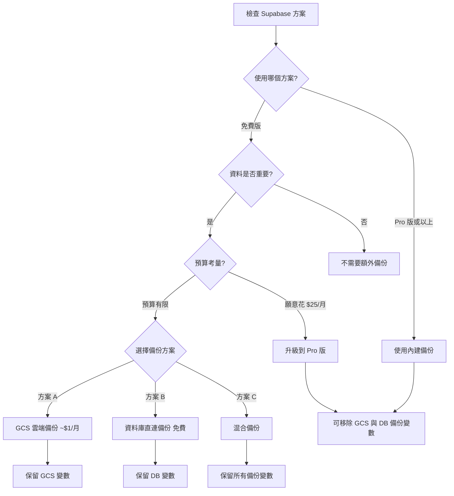

# Supabase 備份指南

**建立時間**: 2026-01-23
**用途**: 說明 Supabase 不同方案的備份功能與建議

---

## 📊 Supabase 方案比較

| 方案 | 月費 | 資料庫容量 | 自動備份 | PITR | 適用場景 |
|------|------|-----------|---------|------|---------|
| **Free** | $0 | 500 MB | ❌ 無 | ❌ 無 | 開發測試 |
| **Pro** | $25 | 8 GB | ✅ 每日 | ✅ 有 | 生產環境 |
| **Team** | $599 | 100 GB | ✅ 每日 | ✅ 有 | 團隊協作 |
| **Enterprise** | 客製 | 無限制 | ✅ 自訂 | ✅ 有 | 企業級應用 |

---

## 🔍 檢查您的當前方案

### 方法 1：透過 Supabase Dashboard

1. 登入 [Supabase Dashboard](https://supabase.com/dashboard)
2. 選擇您的專案
3. 點擊左下角「Settings」
4. 點擊「Billing」
5. 查看「Current Plan」欄位

### 方法 2：檢查備份功能

1. 前往 Settings → Database → Backups
2. 如果看到「Daily Backups」選項 → **Pro 版或以上**
3. 如果顯示「Upgrade to enable backups」→ **免費版**

---

## 📦 免費版備份方案

### ⚠️ 重要提醒

Supabase 免費版**沒有自動備份功能**，您需要自行設定備份機制。

### 方案 A：GCS 雲端備份（推薦）

**優點**：
- ✅ 自動化備份（Vercel Cron）
- ✅ 異地備份（容災）
- ✅ 長期保存
- ✅ 版本控制

**需要的環境變數**：
```env
GCS_SERVICE_ACCOUNT_KEY={"type":"service_account",...}
GCS_BUCKET_NAME=vsale-backups
GCS_PROJECT_ID=your-gcp-project-id
CRON_SECRET=your_random_secret
```

**設定步驟**：參考 [環境變數檢查清單](ENV_VARIABLES_CHECKLIST.md)

**成本**：
- Google Cloud Storage: 約 $0.02/GB/月（亞洲區域）
- Vercel Cron: 免費（Hobby 方案限制）
- 估計月費：< $1（假設備份檔案 < 50GB）

### 方案 B：資料庫直連備份

**優點**：
- ✅ 本地備份控制
- ✅ 不需要第三方服務
- ✅ 免費（僅需儲存空間）

**需要的環境變數**：
```env
DB_HOST=db.YOUR_PROJECT_REF.supabase.co
DB_PORT=5432
DB_NAME=postgres
DB_USER=postgres
DB_PASSWORD=your_database_password
```

**手動備份指令**：
```bash
# 備份到本地
pnpm backup:local

# 備份檔案位置
# Windows: C:\Users\<username>\vsale-backups\
# Linux/Mac: ~/vsale-backups/
```

**自動化備份**（Windows Task Scheduler）：
```powershell
# 建立每日備份排程
$action = New-ScheduledTaskAction -Execute "powershell.exe" -Argument "-Command `"cd d:\APP\vsale; pnpm backup:local`""
$trigger = New-ScheduledTaskTrigger -Daily -At 2:00AM
Register-ScheduledTask -TaskName "Vsale Daily Backup" -Action $action -Trigger $trigger
```

### 方案 C：混合備份（最安全）

結合 GCS 雲端備份 + 本地備份：
- ✅ 雙重保障
- ✅ 異地容災
- ✅ 本地快速還原

**需要所有備份相關變數**（8 個）。

---

## 📦 Pro 版備份功能

### ✅ 內建自動備份

Pro 版及以上方案提供：
- ✅ **每日自動備份** - 凌晨執行
- ✅ **Point-in-Time Recovery (PITR)** - 可還原到特定時間點
- ✅ **7 天保留期** - Pro 版預設保留 7 天
- ✅ **一鍵還原** - 透過 Dashboard 操作

### 📖 使用 Supabase 內建備份

1. 前往 [Supabase Dashboard](https://supabase.com/dashboard)
2. Settings → Database → Backups
3. 選擇備份時間點
4. 點擊「Restore」還原

### 💡 Pro 版是否需要 GCS 備份？

**一般情況不需要**：
- ✅ Supabase 內建備份已足夠
- ✅ 有 PITR 功能
- ✅ 保留期可調整

**以下情況建議額外備份**：
- ⚠️ 需要保留超過 7 天的備份
- ⚠️ 需要異地容災（Supabase 機房故障）
- ⚠️ 合規要求（資料保存期限）
- ⚠️ 需要備份到自己的儲存空間

---

## 🔧 環境變數配置建議

### 使用免費版

**推薦配置**（6-11 個變數）：

```env
# 核心變數（必要）
NEXT_PUBLIC_SUPABASE_URL=...
NEXT_PUBLIC_SUPABASE_ANON_KEY=...
SUPABASE_SERVICE_ROLE_KEY=...

# 備份方案 A：GCS 雲端備份（推薦）
GCS_SERVICE_ACCOUNT_KEY=...
GCS_BUCKET_NAME=...
GCS_PROJECT_ID=...
CRON_SECRET=...

# 備份方案 B：資料庫直連備份（替代方案）
# DB_HOST=...
# DB_PORT=...
# DB_NAME=...
# DB_USER=...
# DB_PASSWORD=...
```

**可以移除**：
```env
# 跨站點遷移（如已完成）
NEXT_PUBLIC_SUPABASE_URL_SITE2
SUPABASE_SERVICE_ROLE_KEY_SITE2
```

### 使用 Pro 版或以上

**最小配置**（3 個變數）：

```env
# 僅需核心變數
NEXT_PUBLIC_SUPABASE_URL=...
NEXT_PUBLIC_SUPABASE_ANON_KEY=...
SUPABASE_SERVICE_ROLE_KEY=...
```

**可以移除**（8-11 個變數）：
```env
# 備份相關（Supabase 內建已足夠）
GCS_SERVICE_ACCOUNT_KEY
GCS_BUCKET_NAME
GCS_PROJECT_ID
CRON_SECRET
DB_HOST
DB_PORT
DB_NAME
DB_USER
DB_PASSWORD

# 跨站點遷移（如已完成）
NEXT_PUBLIC_SUPABASE_URL_SITE2
SUPABASE_SERVICE_ROLE_KEY_SITE2
```

---

## 💰 成本分析

### 免費版 + GCS 備份

| 項目 | 月費 |
|------|------|
| Supabase Free | $0 |
| GCS 儲存 (< 50GB) | < $1 |
| Vercel Cron | $0 |
| **總計** | **< $1/月** |

### 升級到 Pro 版

| 項目 | 月費 |
|------|------|
| Supabase Pro | $25 |
| 內建備份 | 已包含 |
| **總計** | **$25/月** |

### 建議

**資料量 < 500MB + 非生產環境**：
- ✅ 使用免費版 + GCS 備份 (< $1/月)

**資料量 > 500MB 或生產環境**：
- ✅ 升級到 Pro 版 ($25/月)
- ✅ 更穩定、更多功能、無需自行維護備份

---

## 🚀 快速決策指南



---

## 📚 相關文件

- [環境變數檢查清單](ENV_VARIABLES_CHECKLIST.md) - 所有變數的詳細說明
- [環境變數精簡指南](../cleanup-env-vars.md) - 精簡方案
- [新用戶部署指南](NEW_DEPLOYMENT_GUIDE.md) - 完整部署流程

---

## 📖 參考資料

- [Supabase Pricing](https://supabase.com/pricing) - 官方定價說明
- [Database Backups | Supabase Docs](https://supabase.com/docs/guides/platform/backups) - 官方備份文件
- [Manually Backup Supabase Postgres Database](https://amirardalan.com/blog/manually-backup-supabase-postgres-database) - 手動備份教學

---

**最後更新**: 2026-01-23
**建議**: 檢查您的 Supabase 方案，選擇適合的備份策略
