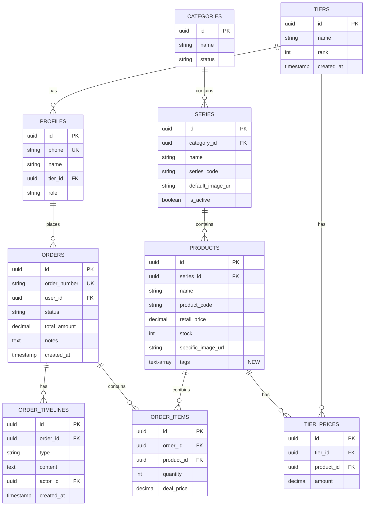
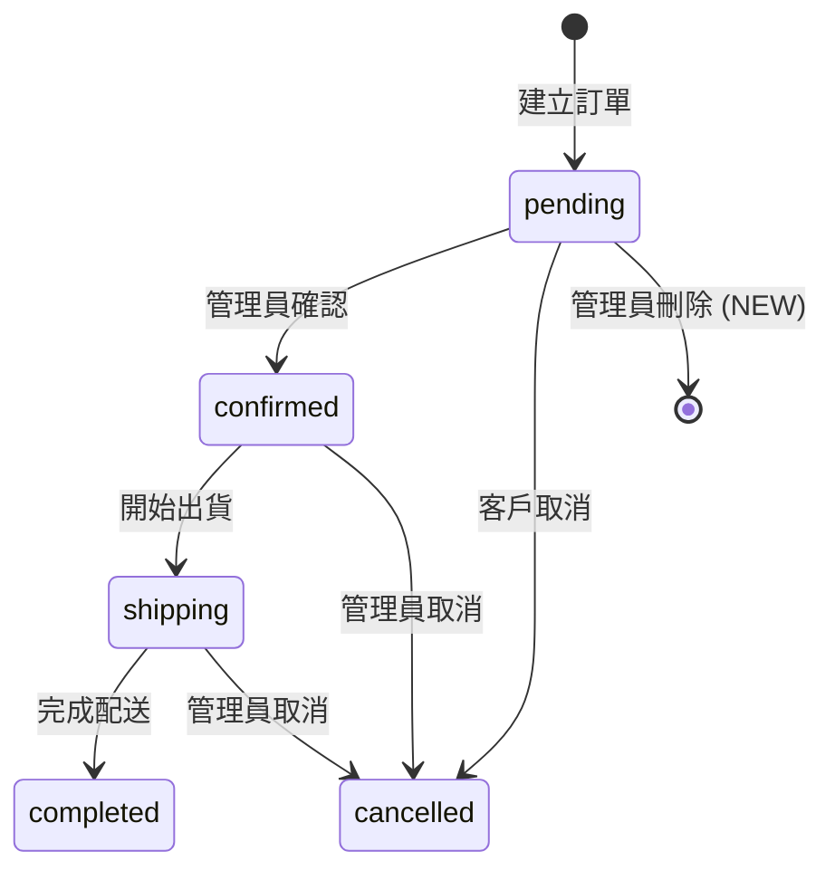

# Data Model: UI/UX 優化與功能強化

**Feature**: 006-ux-enhancement
**Date**: 2026-01-04
**Status**: Design Phase

---

## Overview

本文件定義 Phase 006 UI/UX 優化專案的資料模型變更與實體關聯。本專案主要為 UI 優化，資料庫變更僅新增欄位與優化索引，不修改現有結構。

---

## Database Schema Changes

### 1. 商品標籤系統 (products.tags)

#### Entity: products (擴充)

**新增欄位**:

| 欄位名稱 | 型別 | 約束 | 預設值 | 說明 |
|---------|------|------|--------|------|
| `tags` | `TEXT[]` | `CHECK (array_length(tags, 1) <= 5)` | `'{}'` | 商品標籤陣列，最多 5 個標籤 |

**索引**:
```sql
CREATE INDEX idx_products_tags ON products USING GIN(tags);
```

**說明**:
- 使用 PostgreSQL 陣列型別儲存標籤，避免多對多關聯表的複雜度
- GIN (Generalized Inverted Index) 索引支援快速陣列查詢
- 約束限制最多 5 個標籤，避免資料過載

**標籤範例**:
```sql
-- 商品範例
{
  "product_id": "uuid",
  "name": "可口可樂 330ml",
  "tags": ["熱銷", "新品", "限量"]
}
```

**查詢範例**:
```sql
-- 查詢包含「熱銷」標籤的商品
SELECT * FROM products WHERE tags @> ARRAY['熱銷'];

-- 查詢包含「熱銷」或「新品」任一標籤的商品
SELECT * FROM products WHERE tags && ARRAY['熱銷', '新品'];

-- 查詢未設定標籤的商品
SELECT * FROM products WHERE tags = '{}';
```

---

### 2. 訂單刪除操作記錄 (order_timelines.type)

#### Entity: order_timelines (擴充)

**現有欄位 type 的可能值擴充**:

| 值 | 說明 |
|----|------|
| `created` | 訂單建立 (既有) |
| `confirmed` | 訂單確認 (既有) |
| `status_changed` | 狀態變更 (既有) |
| `cancelled` | 訂單取消 (既有) |
| `deleted` | **訂單刪除 (新增)** |

**說明**:
- `type` 欄位為 `TEXT` 型別，不需 Migration 修改結構
- 僅需更新註解 (COMMENT) 說明新增的 `deleted` 類型

**刪除操作記錄範例**:
```sql
INSERT INTO order_timelines (order_id, type, content, actor_id, created_at)
VALUES (
  'order-uuid',
  'deleted',
  '管理員刪除訂單 (原因: 測試訂單)',
  'admin-uuid',
  NOW()
);
```

---

## Entity Relationships

### 現有實體關聯圖 (不變更)



**變更說明**:
- ✅ `PRODUCTS` 實體新增 `tags TEXT[]` 欄位 (標示為 "NEW")
- ✅ `ORDER_TIMELINES` 實體的 `type` 欄位支援新值 `deleted`
- ❌ 無其他結構變更

---

## Data Validation Rules

### 1. 商品標籤驗證

**Server-side (Zod Schema)**:
```typescript
// lib/validations/product.schema.ts
export const productTagsSchema = z.object({
  tags: z.array(z.string().min(2).max(8))
    .max(5, '最多只能設定 5 個標籤')
    .optional()
    .default([])
});

// 標籤名稱驗證
export const tagNameSchema = z.string()
  .min(2, '標籤名稱至少 2 個字元')
  .max(8, '標籤名稱最多 8 個字元')
  .regex(/^[\u4e00-\u9fa5a-zA-Z0-9]+$/, '標籤僅允許中英文與數字');
```

**Database-side (PostgreSQL Constraint)**:
```sql
-- 標籤數量限制
ALTER TABLE products
  ADD CONSTRAINT check_tags_length
  CHECK (array_length(tags, 1) IS NULL OR array_length(tags, 1) <= 5);

-- 標籤長度限制 (選用, 可在應用層驗證)
-- 注意: PostgreSQL 不支援陣列元素長度約束，需在應用層處理
```

---

### 2. Excel 匯入資料驗證

**Client Import Schema**:
```typescript
// lib/validations/excel.schema.ts
export const clientImportSchema = z.object({
  phone: z.string()
    .regex(/^09\d{8}$/, '手機號碼格式錯誤 (需為 09xxxxxxxx)'),
  name: z.string()
    .min(2, '姓名至少 2 個字元')
    .max(50, '姓名最多 50 個字元'),
  tier_name: z.string()
    .min(1, '會員等級不可為空'),
  password: z.string()
    .min(6, '密碼至少 6 個字元')
    .optional()
});

// 批次匯入驗證
export const batchImportSchema = z.object({
  clients: z.array(clientImportSchema)
    .min(1, '至少需匯入 1 筆資料')
    .max(1000, '單次匯入最多 1000 筆資料')
});
```

**驗證流程**:
1. 驗證檔案格式 (MIME type, 副檔名)
2. 解析 Excel 檔案 (SheetJS)
3. 驗證每筆資料格式 (Zod Schema)
4. 檢查手機號碼是否重複 (資料庫查詢)
5. 檢查會員等級是否存在 (資料庫查詢)
6. 批次寫入資料庫 (Supabase Batch Insert)

---

### 3. 訂單刪除驗證

**Delete Order Schema**:
```typescript
// lib/validations/order.schema.ts
export const deleteOrderSchema = z.object({
  order_id: z.string().uuid('訂單 ID 格式錯誤'),
  reason: z.string()
    .min(5, '刪除原因至少 5 個字元')
    .max(200, '刪除原因最多 200 個字元')
    .optional()
});
```

**Server Action 驗證流程**:
```typescript
export async function deleteOrder(order_id: string, reason?: string) {
  // 1. 驗證輸入
  const validated = deleteOrderSchema.parse({ order_id, reason });

  // 2. 檢查權限 (僅管理員可刪除)
  const { user } = await checkAuth();
  if (user.role !== 'admin') {
    throw new Error('無權限執行此操作');
  }

  // 3. 查詢訂單狀態
  const order = await getOrderById(order_id);
  if (order.status !== 'pending') {
    throw new Error('僅允許刪除 pending 狀態的訂單');
  }

  // 4. 刪除訂單 (硬刪除)
  await supabase.from('orders').delete().eq('id', order_id);

  // 5. 記錄操作歷史
  await supabase.from('order_timelines').insert({
    order_id,
    type: 'deleted',
    content: `管理員刪除訂單 (原因: ${reason || '未提供'})`,
    actor_id: user.id
  });
}
```

---

## State Transitions

### 訂單狀態機 (擴充刪除操作)



**狀態說明**:
- ✅ `pending` 狀態可刪除 (硬刪除，從資料庫移除)
- ❌ `confirmed` 及後續狀態不可刪除 (僅可取消)

---

## Migration Files

### Migration 1: 新增商品標籤欄位

**檔案**: `supabase/migrations/20260109_add_product_tags.sql`

```sql
-- 新增商品標籤欄位
ALTER TABLE products
  ADD COLUMN tags TEXT[] DEFAULT '{}';

-- 建立 GIN 索引支援陣列查詢
CREATE INDEX idx_products_tags ON products USING GIN(tags);

-- 新增約束: 標籤數量不超過 5 個
ALTER TABLE products
  ADD CONSTRAINT check_tags_length
  CHECK (array_length(tags, 1) IS NULL OR array_length(tags, 1) <= 5);

-- 新增註解
COMMENT ON COLUMN products.tags IS '商品標籤陣列，如 {"熱銷", "新品", "限量"}，最多 5 個';

-- 範例: 為現有商品新增標籤 (選用)
-- UPDATE products SET tags = ARRAY['熱銷'] WHERE name LIKE '%可口可樂%';
```

---

### Migration 2: 訂單刪除操作記錄

**檔案**: `supabase/migrations/20260110_add_order_delete_action.sql`

```sql
-- 更新 order_timelines.type 欄位註解，說明支援 'deleted' 類型
COMMENT ON COLUMN order_timelines.type IS '操作類型: created, confirmed, status_changed, cancelled, deleted';

-- 無需修改結構，type 欄位為 TEXT 型別，已支援任意值
```

---

## Data Population (Test Data)

### 測試標籤資料

```sql
-- 為測試商品新增標籤
UPDATE products SET tags = ARRAY['熱銷', '新品']
WHERE name LIKE '%可口可樂%';

UPDATE products SET tags = ARRAY['限量', '促銷']
WHERE name LIKE '%洋芋片%';

UPDATE products SET tags = ARRAY['熱銷']
WHERE stock > 50;

-- 驗證標籤查詢效能
EXPLAIN ANALYZE
SELECT * FROM products WHERE tags @> ARRAY['熱銷'];
```

---

## Performance Considerations

### 索引策略

1. **商品標籤查詢**:
   - GIN 索引支援 `@>` (包含) 與 `&&` (交集) 運算子
   - 預期查詢時間 < 100ms (10,000 筆商品)

2. **搜尋查詢**:
   - `products.name` 建議新增 B-tree 索引 (支援 ILIKE)
   - `products.product_code` 已有唯一索引

```sql
-- 建議新增索引 (若尚未建立)
CREATE INDEX idx_products_name ON products(name);
CREATE INDEX idx_products_product_code ON products(product_code);
```

---

## Rollback Plan

### Rollback Migration 1 (移除商品標籤)

```sql
-- 移除約束
ALTER TABLE products DROP CONSTRAINT IF EXISTS check_tags_length;

-- 移除索引
DROP INDEX IF EXISTS idx_products_tags;

-- 移除欄位
ALTER TABLE products DROP COLUMN IF EXISTS tags;
```

### Rollback Migration 2 (無需回滾)

```sql
-- Migration 2 僅更新註解，無需回滾
-- 若需回復註解，執行:
COMMENT ON COLUMN order_timelines.type IS '操作類型: created, confirmed, status_changed, cancelled';
```

---

## Conclusion

本專案資料庫變更極簡化，僅新增一個欄位 (`products.tags`) 與一個操作類型 (`deleted`)，完全向後相容，不影響現有功能。

**變更總覽**:
- ✅ 新增欄位: 1 個 (`products.tags`)
- ✅ 新增索引: 1 個 (GIN 索引)
- ✅ 新增約束: 1 個 (標籤數量限制)
- ✅ 新增操作類型: 1 個 (`order_timelines.type = 'deleted'`)
- ❌ 無修改現有欄位
- ❌ 無刪除任何資料

**風險評估**: 🟢 **低風險** - 僅新增欄位，不破壞現有資料與功能

---

**文件版本**: 1.0.0
**建立日期**: 2026-01-04
**負責人**: Claude Sonnet 4.5
