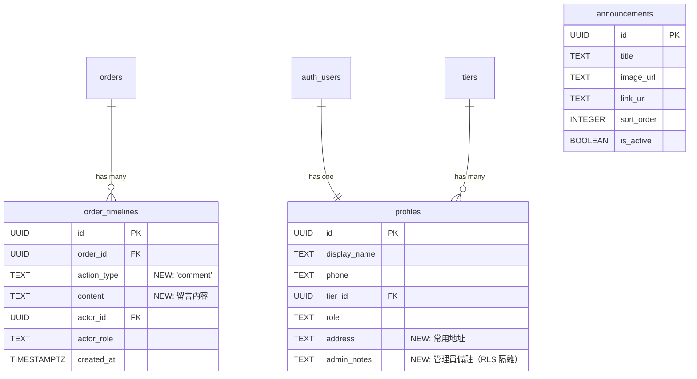

# Data Model: 系統擴充功能集

**Feature**: 007-system-enhancement
**Date**: 2026-01-03
**Status**: Phase 1 - Data Model Design

---

## 概述

本功能集涉及以下資料表的修改與新增：

1. **擴充既有表**：
   - `order_timelines`：擴充 `action_type` ENUM，支援訂單留言功能
   - `profiles`：新增 `address` 與 `admin_notes` 欄位

2. **新增資料表**：
   - `announcements`：廣告輪播資料表

3. **不修改的表**：
   - `tier_prices`：價格管理優化僅修改 UI，不變更資料表結構

---

## 資料表設計

### 1. order_timelines（訂單操作歷史 - 擴充）

**用途**：記錄訂單的所有操作事件與留言，統一顯示在時間軸上。

**既有欄位**：
```sql
CREATE TABLE order_timelines (
  id UUID PRIMARY KEY DEFAULT gen_random_uuid(),
  order_id UUID NOT NULL REFERENCES orders(id) ON DELETE CASCADE,
  action_type TEXT NOT NULL CHECK (action_type IN ('created', 'confirmed', 'status_updated', 'cancelled')),
  content TEXT,
  old_status TEXT,
  new_status TEXT,
  actor_id UUID REFERENCES auth.users(id),
  actor_role TEXT CHECK (actor_role IN ('client', 'admin')),
  created_at TIMESTAMPTZ DEFAULT NOW()
);
```

**新增 ENUM 值**：
```sql
-- 擴充 action_type 以支援留言功能
ALTER TABLE order_timelines DROP CONSTRAINT IF EXISTS order_timelines_action_type_check;
ALTER TABLE order_timelines ADD CONSTRAINT order_timelines_action_type_check
  CHECK (action_type IN ('created', 'confirmed', 'status_updated', 'cancelled', 'comment'));
```

**欄位說明**：

| 欄位 | 型別 | 約束 | 說明 |
|------|------|------|------|
| `id` | UUID | PRIMARY KEY | 記錄唯一識別碼 |
| `order_id` | UUID | FOREIGN KEY | 關聯訂單 |
| `action_type` | TEXT | CHECK | **新增 `'comment'`**，表示留言 |
| `content` | TEXT | - | **留言內容**（當 action_type = 'comment'） |
| `old_status` | TEXT | - | 狀態變更前（當 action_type = 'status_updated'） |
| `new_status` | TEXT | - | 狀態變更後（當 action_type = 'status_updated'） |
| `actor_id` | UUID | FOREIGN KEY | 操作者或留言者 ID |
| `actor_role` | TEXT | CHECK | 角色（'client' 或 'admin'） |
| `created_at` | TIMESTAMPTZ | DEFAULT NOW() | 建立時間（排序依據） |

**索引**：
```sql
-- 既有索引（已存在）
CREATE INDEX idx_order_timelines_order_id ON order_timelines(order_id);
CREATE INDEX idx_order_timelines_created_at ON order_timelines(created_at DESC);
```

**RLS 策略**：
```sql
-- 客戶端：僅能查詢自己的訂單歷史與留言
CREATE POLICY "client_select_order_timelines" ON order_timelines
  FOR SELECT
  TO authenticated
  USING (
    EXISTS (
      SELECT 1 FROM orders
      WHERE orders.id = order_timelines.order_id
      AND orders.user_id = auth.uid()
    )
  );

-- 客戶端：僅能在自己的訂單新增留言
CREATE POLICY "client_insert_comment" ON order_timelines
  FOR INSERT
  TO authenticated
  WITH CHECK (
    action_type = 'comment' AND
    EXISTS (
      SELECT 1 FROM orders
      WHERE orders.id = order_timelines.order_id
      AND orders.user_id = auth.uid()
    )
  );

-- 管理員：可查詢所有訂單歷史與留言
CREATE POLICY "admin_select_order_timelines" ON order_timelines
  FOR SELECT
  TO authenticated
  USING ((SELECT role FROM profiles WHERE id = auth.uid()) = 'admin');

-- 管理員：可在任何訂單新增留言
CREATE POLICY "admin_insert_comment" ON order_timelines
  FOR INSERT
  TO authenticated
  WITH CHECK (
    action_type = 'comment' AND
    (SELECT role FROM profiles WHERE id = auth.uid()) = 'admin'
  );
```

**驗證規則**：
- `content` 欄位：當 `action_type = 'comment'` 時，長度限制 1-500 字（透過 Zod 驗證）
- `actor_id` 與 `actor_role` 必須一致（透過 Server Action 確保）

---

### 2. profiles（客戶資料 - 擴充）

**用途**：儲存客戶的業務資訊，包含常用地址與管理員備註。

**既有欄位**：
```sql
CREATE TABLE profiles (
  id UUID PRIMARY KEY REFERENCES auth.users(id) ON DELETE CASCADE,
  display_name TEXT NOT NULL,
  phone TEXT UNIQUE NOT NULL,
  tier_id UUID NOT NULL REFERENCES tiers(id),
  role TEXT NOT NULL CHECK (role IN ('client', 'admin')),
  status TEXT NOT NULL DEFAULT 'active' CHECK (status IN ('active', 'inactive')),
  created_at TIMESTAMPTZ DEFAULT NOW(),
  updated_at TIMESTAMPTZ DEFAULT NOW()
);
```

**新增欄位**：
```sql
ALTER TABLE profiles
  ADD COLUMN address TEXT,
  ADD COLUMN admin_notes TEXT;
```

**欄位說明**：

| 欄位 | 型別 | 約束 | 說明 |
|------|------|------|------|
| `id` | UUID | PRIMARY KEY | 使用者 ID（關聯 auth.users） |
| `display_name` | TEXT | NOT NULL | 顯示名稱 |
| `phone` | TEXT | UNIQUE | 手機號碼（登入用） |
| `tier_id` | UUID | FOREIGN KEY | 會員等級 |
| `role` | TEXT | CHECK | 角色（'client' 或 'admin'） |
| `status` | TEXT | CHECK | 狀態（'active' 或 'inactive'） |
| **`address`** | TEXT | - | **常用地址**（客戶端可見） |
| **`admin_notes`** | TEXT | - | **管理員備註**（僅管理端可見） |
| `created_at` | TIMESTAMPTZ | DEFAULT NOW() | 建立時間 |
| `updated_at` | TIMESTAMPTZ | DEFAULT NOW() | 更新時間 |

**RLS 策略（修改）**：
```sql
-- 客戶端：僅能查詢自己的資料，且排除 admin_notes 欄位
-- 注意：Supabase RLS 不支援欄位級別限制，需透過 Server Actions 控制
CREATE POLICY "client_select_own_profile" ON profiles
  FOR SELECT
  TO authenticated
  USING (
    id = auth.uid() AND role = 'client'
  );

-- 客戶端：僅能更新自己的 display_name 與 address（不可更新 admin_notes）
CREATE POLICY "client_update_own_profile" ON profiles
  FOR UPDATE
  TO authenticated
  USING (id = auth.uid() AND role = 'client')
  WITH CHECK (id = auth.uid() AND role = 'client');

-- 管理員：可查詢所有客戶資料（包含 admin_notes）
CREATE POLICY "admin_select_profiles" ON profiles
  FOR SELECT
  TO authenticated
  USING ((SELECT role FROM profiles WHERE id = auth.uid()) = 'admin');

-- 管理員：可更新所有客戶資料（包含 admin_notes）
CREATE POLICY "admin_update_profiles" ON profiles
  FOR UPDATE
  TO authenticated
  USING ((SELECT role FROM profiles WHERE id = auth.uid()) = 'admin')
  WITH CHECK ((SELECT role FROM profiles WHERE id = auth.uid()) = 'admin');
```

**欄位隔離策略**：
- RLS 無法在資料庫層級排除特定欄位，需透過 Server Actions 控制：
  - 客戶端 `getProfile()` Server Action：僅返回 `id, display_name, phone, tier_id, address`
  - 管理端 `getClientById()` Server Action：返回所有欄位（包含 `admin_notes`）

**驗證規則**：
- `address`：可選欄位，無長度限制（透過 UI 控制為文字區域，3 行高度）
- `admin_notes`：可選欄位，無長度限制（透過 UI 控制為文字區域，3 行高度）

---

### 3. announcements（廣告輪播 - 新增）

**用途**：儲存前台首頁的廣告輪播資料。

**資料表定義**：
```sql
CREATE TABLE announcements (
  id UUID PRIMARY KEY DEFAULT gen_random_uuid(),
  title TEXT NOT NULL,
  image_url TEXT NOT NULL,
  link_url TEXT,
  sort_order INTEGER NOT NULL DEFAULT 0,
  is_active BOOLEAN NOT NULL DEFAULT true,
  created_at TIMESTAMPTZ DEFAULT NOW(),
  updated_at TIMESTAMPTZ DEFAULT NOW()
);
```

**欄位說明**：

| 欄位 | 型別 | 約束 | 說明 |
|------|------|------|------|
| `id` | UUID | PRIMARY KEY | 廣告唯一識別碼 |
| `title` | TEXT | NOT NULL | 廣告標題（用於管理端顯示與 alt 文字） |
| `image_url` | TEXT | NOT NULL | 圖片 URL（Supabase Storage 路徑） |
| `link_url` | TEXT | - | 點擊跳轉連結（可選） |
| `sort_order` | INTEGER | DEFAULT 0 | 排序順序（數字越小越前面） |
| `is_active` | BOOLEAN | DEFAULT true | 是否啟用（僅啟用的廣告會顯示） |
| `created_at` | TIMESTAMPTZ | DEFAULT NOW() | 建立時間 |
| `updated_at` | TIMESTAMPTZ | DEFAULT NOW() | 更新時間 |

**索引**：
```sql
-- 用於前台查詢（依排序順序取前 5 則啟用的廣告）
CREATE INDEX idx_announcements_active_sort ON announcements(is_active, sort_order)
  WHERE is_active = true;
```

**RLS 策略**：
```sql
-- 所有使用者（包含未登入）可查詢啟用的廣告
CREATE POLICY "public_select_active_announcements" ON announcements
  FOR SELECT
  TO public
  USING (is_active = true);

-- 管理員可查詢所有廣告
CREATE POLICY "admin_select_all_announcements" ON announcements
  FOR SELECT
  TO authenticated
  USING ((SELECT role FROM profiles WHERE id = auth.uid()) = 'admin');

-- 管理員可新增、編輯、刪除廣告
CREATE POLICY "admin_manage_announcements" ON announcements
  FOR ALL
  TO authenticated
  USING ((SELECT role FROM profiles WHERE id = auth.uid()) = 'admin')
  WITH CHECK ((SELECT role FROM profiles WHERE id = auth.uid()) = 'admin');
```

**驗證規則**：
- `title`：1-100 字（透過 Zod 驗證）
- `image_url`：必須為 Supabase Storage URL（格式驗證）
- `link_url`：可選，若填寫則需為有效 URL（透過 Zod 驗證）
- `sort_order`：整數，預設 0

**圖片儲存策略**：
- 儲存路徑：`announcements/{announcement_id}/main.{ext}`
- 支援格式：JPG, PNG, WebP
- 大小限制：5MB
- 覆寫模式：`upsert: true`（允許重新上傳）

---

## 資料關聯圖



---

## Migration 腳本

```sql
-- Migration: 007_system_enhancement.sql
-- Date: 2026-01-03

BEGIN;

-- 1. 擴充 order_timelines.action_type ENUM
ALTER TABLE order_timelines DROP CONSTRAINT IF EXISTS order_timelines_action_type_check;
ALTER TABLE order_timelines ADD CONSTRAINT order_timelines_action_type_check
  CHECK (action_type IN ('created', 'confirmed', 'status_updated', 'cancelled', 'comment'));

-- 2. 擴充 profiles 表新增欄位
ALTER TABLE profiles
  ADD COLUMN IF NOT EXISTS address TEXT,
  ADD COLUMN IF NOT EXISTS admin_notes TEXT;

-- 3. 新增 announcements 表
CREATE TABLE IF NOT EXISTS announcements (
  id UUID PRIMARY KEY DEFAULT gen_random_uuid(),
  title TEXT NOT NULL,
  image_url TEXT NOT NULL,
  link_url TEXT,
  sort_order INTEGER NOT NULL DEFAULT 0,
  is_active BOOLEAN NOT NULL DEFAULT true,
  created_at TIMESTAMPTZ DEFAULT NOW(),
  updated_at TIMESTAMPTZ DEFAULT NOW()
);

-- 4. 建立索引
CREATE INDEX IF NOT EXISTS idx_announcements_active_sort ON announcements(is_active, sort_order)
  WHERE is_active = true;

-- 5. 啟用 RLS
ALTER TABLE announcements ENABLE ROW LEVEL SECURITY;

-- 6. 建立 RLS 策略（order_timelines）
DROP POLICY IF EXISTS "client_select_order_timelines" ON order_timelines;
CREATE POLICY "client_select_order_timelines" ON order_timelines
  FOR SELECT
  TO authenticated
  USING (
    EXISTS (
      SELECT 1 FROM orders
      WHERE orders.id = order_timelines.order_id
      AND orders.user_id = auth.uid()
    )
  );

DROP POLICY IF EXISTS "client_insert_comment" ON order_timelines;
CREATE POLICY "client_insert_comment" ON order_timelines
  FOR INSERT
  TO authenticated
  WITH CHECK (
    action_type = 'comment' AND
    EXISTS (
      SELECT 1 FROM orders
      WHERE orders.id = order_timelines.order_id
      AND orders.user_id = auth.uid()
    )
  );

DROP POLICY IF EXISTS "admin_select_order_timelines" ON order_timelines;
CREATE POLICY "admin_select_order_timelines" ON order_timelines
  FOR SELECT
  TO authenticated
  USING ((SELECT role FROM profiles WHERE id = auth.uid()) = 'admin');

DROP POLICY IF EXISTS "admin_insert_comment" ON order_timelines;
CREATE POLICY "admin_insert_comment" ON order_timelines
  FOR INSERT
  TO authenticated
  WITH CHECK (
    action_type = 'comment' AND
    (SELECT role FROM profiles WHERE id = auth.uid()) = 'admin'
  );

-- 7. 建立 RLS 策略（announcements）
DROP POLICY IF EXISTS "public_select_active_announcements" ON announcements;
CREATE POLICY "public_select_active_announcements" ON announcements
  FOR SELECT
  TO public
  USING (is_active = true);

DROP POLICY IF EXISTS "admin_select_all_announcements" ON announcements;
CREATE POLICY "admin_select_all_announcements" ON announcements
  FOR SELECT
  TO authenticated
  USING ((SELECT role FROM profiles WHERE id = auth.uid()) = 'admin');

DROP POLICY IF EXISTS "admin_manage_announcements" ON announcements;
CREATE POLICY "admin_manage_announcements" ON announcements
  FOR ALL
  TO authenticated
  USING ((SELECT role FROM profiles WHERE id = auth.uid()) = 'admin')
  WITH CHECK ((SELECT role FROM profiles WHERE id = auth.uid()) = 'admin');

COMMIT;
```

---

## 資料驗證規則摘要

| 實體 | 欄位 | 驗證規則 |
|------|------|---------|
| `order_timelines` | `content` | 當 `action_type = 'comment'` 時，1-500 字 |
| `profiles` | `address` | 可選，無長度限制 |
| `profiles` | `admin_notes` | 可選，無長度限制（僅管理端可見） |
| `announcements` | `title` | 1-100 字 |
| `announcements` | `image_url` | 必須為 Supabase Storage URL |
| `announcements` | `link_url` | 可選，若填寫則需為有效 URL |
| `announcements` | `sort_order` | 整數，預設 0 |

---

**資料模型設計完成日期**: 2026-01-03
**下一步**: 生成 API 合約定義（contracts/）
