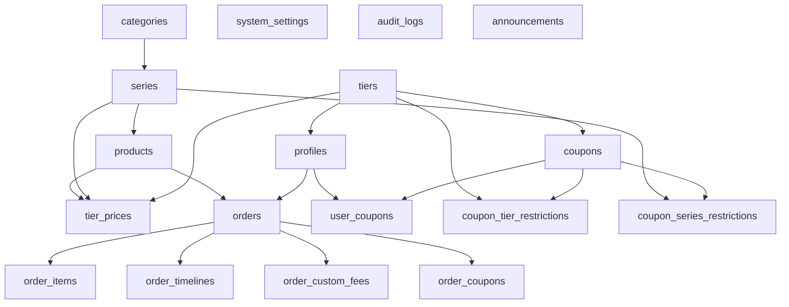

# Data Model: Migration 整合與資料庫優化

**Version**: 1.0
**Date**: 2026-01-07
**Related**: [spec.md](./spec.md), [plan.md](./plan.md), [research.md](./research.md)

---

## 概述

本文件定義 Migration 整合專案的資料模型，包含：
1. **整合檔案對應表** - 27 個舊 Migration 如何分組到 8 個新檔案
2. **Migration 依賴關係圖** - 表與表之間的 FK 依賴（確保執行順序正確）
3. **備份元數據 Schema** - JSON 格式，儲存備份資訊
4. **健康檢查報告格式** - 錯誤數、警告數、具體問題清單

---

## 一、整合檔案對應表

### 1.1 完整對應清單

| 新檔案編號 | 新檔案名稱 | 包含的舊 Migration (按執行順序) | 檔案數量 | 功能描述 |
|-----------|-----------|--------------------------------|---------|---------|
| **M1** | `20260107100000_core_auth_and_tiers.sql` | | 2 | 核心認證與會員等級 |
| | | 1. `20260101_initial_schema.sql` | | 基礎資料表 |
| | | 2. `20260104_fix_profiles_rls.sql` | | RLS 修復 |
| **M2** | `20260107110000_product_catalog_system.sql` | | 4 | 商品目錄系統 |
| | | 1. `20260102_products_and_categories.sql` | | 基礎資料表 |
| | | 2. `20260110_add_product_tags.sql` | | 商品標籤 |
| | | 3. `20260112_add_product_search_indexes.sql` | | 搜尋索引 |
| | | 4. `20260116_add_unique_name_constraints.sql` | | 唯一性約束 |
| **M3** | `20260107120000_orders_and_workflow.sql` | | 6 | 訂單與工作流程 |
| | | 1. `20260107_create_orders.sql` | | 訂單基礎資料表 |
| | | 2. `20260108_fix_orders_rls_insert.sql` | | RLS 修復 |
| | | 3. `20260106_add_delete_order_function.sql` | | 刪除函數 |
| | | 4. `20260111_add_order_delete_action.sql` | | 刪除操作支援 |
| | | 5. `20260117_grant_order_functions.sql` | | 函數權限授予 |
| | | 6. `20260118_fix_order_functions_action_type.sql` | | action_type 修復 |
| **M4** | `20260107130000_shipping_and_custom_fees.sql` | | 5 | 運費與自訂費用 |
| | | 1. `20260122_add_shipping_features.sql` | | 運費設定 |
| | | 2. `20260123_remove_confirmed_status.sql` | | 移除 confirmed 狀態 |
| | | 3. `20260124_extend_order_timelines.sql` | | 訂單修改歷程 |
| | | 4. `20260125_fix_order_modifications_function.sql` | | 修改函數修復 |
| | | 5. `20260126_fix_cancel_order_allow_shipping.sql` | | 取消訂單修復 |
| **M5** | `20260107140000_coupon_system.sql` | | 3 | 優惠券系統 |
| | | 1. `20260119_create_coupons.sql` | | 優惠券基礎資料表 |
| | | 2. `20260120_add_coupon_claim_limit.sql` | | 領取張數限制 |
| | | 3. `20260121_add_order_coupons_insert_policy.sql` | | 訂單優惠券 RLS |
| **M6** | `20260107150000_system_admin_and_audit.sql` | | 3 | 系統管理與稽核 |
| | | 1. `20260113_system_admin.sql` | | 管理員與系統設定 |
| | | 2. `20260114_add_audit_logs_insert_policy.sql` | | 操作日誌 RLS |
| | | 3. `20260115_update_system_settings_description.sql` | | 設定描述欄位 |
| **M7** | `20260107160000_indexes_and_performance.sql` | | 1 + 新增 | 索引與效能優化 |
| | | 1. 整合所有現有索引定義 | | 現有索引 |
| | | 2. 新增 3 個效能優化索引 | | 新增索引 |
| **M8** | `20260107170000_rls_policies.sql` | | 整合 | RLS 策略 |
| | | 整合所有 RLS Policy 定義 | | 18 個表的 RLS |

### 1.2 檔案數量統計

| 類型 | 數量 |
|------|-----|
| 整合前舊檔案 | 27 個 |
| 整合後新檔案 | 8 個 |
| 減少數量 | 19 個 |
| 減少比例 | **70%** |

### 1.3 時間戳命名規則

```
20260107100000 → 2026-01-07 10:00:00 (M1)
20260107110000 → 2026-01-07 11:00:00 (M2)
20260107120000 → 2026-01-07 12:00:00 (M3)
20260107130000 → 2026-01-07 13:00:00 (M4)
20260107140000 → 2026-01-07 14:00:00 (M5)
20260107150000 → 2026-01-07 15:00:00 (M6)
20260107160000 → 2026-01-07 16:00:00 (M7)
20260107170000 → 2026-01-07 17:00:00 (M8)
```

---

## 二、Migration 依賴關係圖

### 2.1 表依賴關係（Mermaid 圖）



### 2.2 Foreign Key 依賴表

| 子表 | 父表 | FK 欄位 | ON DELETE | 所屬模組 |
|------|------|---------|-----------|---------|
| `profiles` | `auth.users` | `id` | CASCADE | M1 |
| `profiles` | `tiers` | `tier_id` | RESTRICT | M1 |
| `series` | `categories` | `category_id` | RESTRICT | M2 |
| `products` | `series` | `series_id` | RESTRICT | M2 |
| `tier_prices` | `tiers` | `tier_id` | CASCADE | M2 |
| `tier_prices` | `products` | `product_id` | CASCADE | M2 |
| `orders` | `auth.users` | `user_id` | RESTRICT | M3 |
| `order_items` | `orders` | `order_id` | CASCADE | M3 |
| `order_items` | `products` | `product_id` | RESTRICT | M3 |
| `order_timelines` | `orders` | `order_id` | CASCADE | M3 |
| `order_custom_fees` | `orders` | `order_id` | CASCADE | M4 |
| `coupons` | `tiers` | (無 FK) | N/A | M5 |
| `user_coupons` | `auth.users` | `user_id` | CASCADE | M5 |
| `user_coupons` | `coupons` | `coupon_id` | CASCADE | M5 |
| `order_coupons` | `orders` | `order_id` | CASCADE | M5 |
| `coupon_tier_restrictions` | `coupons` | `coupon_id` | CASCADE | M5 |
| `coupon_tier_restrictions` | `tiers` | `tier_id` | CASCADE | M5 |
| `coupon_series_restrictions` | `coupons` | `coupon_id` | CASCADE | M5 |
| `coupon_series_restrictions` | `series` | `series_id` | CASCADE | M5 |

### 2.3 執行順序規則

**跨檔案執行順序**:
```
M1 (tiers, profiles)
  ↓
M2 (categories, series, products, tier_prices)
  ↓
M3 (orders, order_items, order_timelines)
  ↓
M4 (order_custom_fees, shipping_fee 擴充)
  ↓
M5 (coupons, user_coupons, order_coupons)
  ↓
M6 (system_settings, audit_logs)
  ↓
M7 (索引優化)
  ↓
M8 (RLS 策略)
```

**檔案內執行順序**:
```
1. CREATE TABLE (父表 → 子表)
2. ALTER TABLE ADD COLUMN
3. ALTER TABLE ADD CONSTRAINT
4. CREATE INDEX
5. CREATE TRIGGER
6. CREATE FUNCTION
7. INSERT (預設資料)
8. UPDATE (資料遷移)
9. ALTER TABLE SET NOT NULL / DROP COLUMN
10. ENABLE ROW LEVEL SECURITY
11. CREATE POLICY
12. GRANT EXECUTE
```

---

## 三、備份元數據 Schema

### 3.1 JSON Schema 定義

```json
{
  "$schema": "http://json-schema.org/draft-07/schema#",
  "type": "object",
  "required": ["backup_time", "reason", "environment", "database", "file", "statistics"],
  "properties": {
    "backup_time": {
      "type": "string",
      "format": "date-time",
      "description": "備份時間（ISO 8601 格式）",
      "example": "2026-01-07T12:05:30.123Z"
    },
    "reason": {
      "type": "string",
      "enum": ["before_reset", "before_migration", "manual_backup", "daily_backup", "before_deploy"],
      "description": "備份原因分類"
    },
    "environment": {
      "type": "string",
      "enum": ["local", "production"],
      "description": "環境類型"
    },
    "database": {
      "type": "object",
      "required": ["host", "port", "name"],
      "properties": {
        "host": {
          "type": "string",
          "description": "資料庫主機",
          "example": "127.0.0.1"
        },
        "port": {
          "type": "integer",
          "description": "資料庫連接埠",
          "example": 54322
        },
        "name": {
          "type": "string",
          "description": "資料庫名稱",
          "example": "postgres"
        }
      }
    },
    "file": {
      "type": "object",
      "required": ["name", "path", "size_bytes", "format"],
      "properties": {
        "name": {
          "type": "string",
          "description": "備份檔案名稱",
          "example": "20260107_120530_before_reset.sql"
        },
        "path": {
          "type": "string",
          "description": "備份檔案完整路徑",
          "example": "D:\\APP\\vsale\\backups\\20260107_120530_before_reset.sql"
        },
        "size_bytes": {
          "type": "integer",
          "description": "檔案大小（位元組）",
          "example": 1234567
        },
        "format": {
          "type": "string",
          "enum": ["plain", "custom"],
          "description": "備份格式",
          "example": "plain"
        }
      }
    },
    "statistics": {
      "type": "object",
      "required": ["table_count", "total_rows", "backup_duration_ms"],
      "properties": {
        "table_count": {
          "type": "integer",
          "description": "資料表數量",
          "example": 18
        },
        "total_rows": {
          "type": "integer",
          "description": "總資料筆數（估算）",
          "example": 452
        },
        "backup_duration_ms": {
          "type": "integer",
          "description": "備份執行時間（毫秒）",
          "example": 3456
        }
      }
    },
    "supabase": {
      "type": "object",
      "properties": {
        "version": {
          "type": "string",
          "description": "Supabase CLI 版本",
          "example": "1.50.0"
        },
        "postgres_version": {
          "type": "string",
          "description": "PostgreSQL 版本",
          "example": "15.6"
        }
      }
    }
  }
}
```

### 3.2 範例 JSON 檔案

**檔案位置**: `backups/20260107_120530_metadata.json`

```json
{
  "backup_time": "2026-01-07T12:05:30.123Z",
  "reason": "before_reset",
  "environment": "local",
  "database": {
    "host": "127.0.0.1",
    "port": 54322,
    "name": "postgres"
  },
  "file": {
    "name": "20260107_120530_before_reset.sql",
    "path": "D:\\APP\\vsale\\backups\\20260107_120530_before_reset.sql",
    "size_bytes": 1234567,
    "format": "plain"
  },
  "statistics": {
    "table_count": 18,
    "total_rows": 452,
    "backup_duration_ms": 3456
  },
  "supabase": {
    "version": "1.50.0",
    "postgres_version": "15.6"
  }
}
```

### 3.3 備份原因分類

| Reason Code | 中文說明 | 使用場景 | 自動/手動 |
|------------|---------|---------|----------|
| `before_reset` | 重置前備份 | 執行 `supabase db reset` 前 | 自動 |
| `before_migration` | Migration 前備份 | 執行 `supabase db push` 前 | 自動 |
| `manual_backup` | 手動備份 | 使用者主動執行備份 | 手動 |
| `daily_backup` | 每日自動備份 | 自動化排程備份 | 自動 |
| `before_deploy` | 部署前備份 | 部署到生產環境前 | 手動 |

---

## 四、健康檢查報告格式

### 4.1 Console 輸出格式

```
========== 資料庫健康檢查報告 ==========
檢查時間: 2026-01-07 12:05:30
環境: 本機 (127.0.0.1:54322)

[✅] Schema 一致性檢查
  - 表數量: 18 / 18 (預期) ✅
  - 欄位數量: 150 / 150 (預期) ✅
  - 約束數量: 35 / 35 (預期) ✅

[✅] 索引完整性檢查
  - 索引數量: 50 / 50 (預期) ✅
  - 缺失索引: 無 ✅
  - 重複索引: 無 ✅

[⚠️] RLS 覆蓋率檢查
  - RLS 啟用表: 18 / 18 (100%) ✅
  - Policy 數量: 68 / 70 (預期) ⚠️
  - 缺失 Policy: orders.delete_admin (管理員刪除訂單)

[✅] 函數授權檢查
  - 函數數量: 9 / 9 (預期) ✅
  - 授權完整性: 9 / 9 (100%) ✅

==========================================
總結: 錯誤: 0, 警告: 1
建議: 檢查缺失的 RLS Policy 並補充
==========================================
```

### 4.2 資料庫儲存格式

**暫存表**: `health_check_results`

```sql
CREATE TEMP TABLE health_check_results (
  check_category TEXT,        -- 檢查類別（Schema, Index, RLS, Function, Constraint）
  check_item TEXT,            -- 檢查項目名稱
  expected_value TEXT,        -- 預期值
  actual_value TEXT,          -- 實際值
  status TEXT,                -- 狀態（PASS, WARNING, ERROR）
  message TEXT,               -- 詳細訊息
  checked_at TIMESTAMPTZ DEFAULT NOW()
);
```

**範例資料**:

| check_category | check_item | expected_value | actual_value | status | message |
|---------------|-----------|---------------|-------------|--------|---------|
| Schema | table_count | 18 | 18 | PASS | 表數量正確 |
| Index | idx_products_series_status_updated | EXISTS | EXISTS | PASS | 索引存在 |
| RLS | orders_delete_admin | EXISTS | MISSING | WARNING | 缺失 Policy: orders.delete_admin |
| Function | generate_order_number | GRANTED | GRANTED | PASS | 函數授權正確 |

### 4.3 檢查項目分類

| 類別 | 檢查項目數量 | 嚴重性 |
|------|------------|-------|
| **Schema 一致性** | 85 項 | ERROR |
| **索引完整性** | 70 項 | WARNING |
| **RLS 覆蓋率** | 40 項 | WARNING |
| **函數授權** | 15 項 | ERROR |
| **約束完整性** | 15 項 | WARNING |
| **總計** | **225 項** | - |

### 4.4 嚴重性定義

| 狀態 | 顏色 | 描述 | 範例 |
|------|-----|------|------|
| **PASS** | 綠色 | 檢查通過 | 表數量正確 |
| **WARNING** | 黃色 | 警告（不影響功能，建議修復） | 缺失效能索引 |
| **ERROR** | 紅色 | 錯誤（影響功能，必須修復） | 缺失必要表 |

---

## 五、資料表清單（整合後）

### 5.1 完整資料表清單（18 個）

| 編號 | 資料表名稱 | 所屬模組 | 功能描述 |
|------|-----------|---------|---------|
| 1 | `tiers` | M1 | 會員等級 |
| 2 | `profiles` | M1 | 使用者業務資料 |
| 3 | `categories` | M2 | 商品分類 |
| 4 | `series` | M2 | 產品系列 |
| 5 | `products` | M2 | 商品 |
| 6 | `tier_prices` | M2 | 等級價格 |
| 7 | `orders` | M3 | 訂單主表 |
| 8 | `order_items` | M3 | 訂單明細 |
| 9 | `order_timelines` | M3 | 訂單操作歷史 |
| 10 | `order_custom_fees` | M4 | 訂單自訂費用 |
| 11 | `coupons` | M5 | 優惠券主表 |
| 12 | `user_coupons` | M5 | 客戶優惠券領取記錄 |
| 13 | `order_coupons` | M5 | 訂單優惠券快照 |
| 14 | `coupon_tier_restrictions` | M5 | 優惠券等級限制 |
| 15 | `coupon_series_restrictions` | M5 | 優惠券系列限制 |
| 16 | `system_settings` | M6 | 系統設定 |
| 17 | `audit_logs` | M6 | 操作日誌 |
| 18 | `announcements` | M2 | 廣告輪播 |

### 5.2 PostgreSQL Functions 清單（9 個）

| 編號 | 函數名稱 | 所屬模組 | 用途 |
|------|---------|---------|------|
| 1 | `update_updated_at_column()` | M1 | 自動更新 updated_at |
| 2 | `generate_product_code()` | M2 | 自動產生商品編號 |
| 3 | `generate_order_number()` | M3 | 產生訂單編號 |
| 4 | `cancel_order_and_restore_stock()` | M3 | 取消訂單並回補庫存 |
| 5 | `update_order_status()` | M3 | 更新訂單狀態 |
| 6 | `calculate_shipping_fee()` | M4 | 計算運費 |
| 7 | `mark_order_as_shipping()` | M4 | 標記出貨並扣減庫存 |
| 8 | `update_order_with_modifications()` | M4 | 批次修改訂單 |
| 9 | (Trigger Function) `update_updated_at_column()` | M1 | Trigger 函數 |

---

## 六、整合檔案大小估算

| 模組 | 整合檔案名稱 | 預估行數 | 預估大小 |
|------|-----------|---------|---------|
| M1 | `20260107100000_core_auth_and_tiers.sql` | 200 | 8 KB |
| M2 | `20260107110000_product_catalog_system.sql` | 600 | 25 KB |
| M3 | `20260107120000_orders_and_workflow.sql` | 800 | 35 KB |
| M4 | `20260107130000_shipping_and_custom_fees.sql` | 500 | 22 KB |
| M5 | `20260107140000_coupon_system.sql` | 400 | 18 KB |
| M6 | `20260107150000_system_admin_and_audit.sql` | 350 | 15 KB |
| M7 | `20260107160000_indexes_and_performance.sql` | 150 | 6 KB |
| M8 | `20260107170000_rls_policies.sql` | 900 | 40 KB |
| **總計** | - | **3900 行** | **169 KB** |

---

## 七、版本歷史

| 版本 | 日期 | 變更內容 |
|------|------|---------|
| 1.0 | 2026-01-07 | 初始版本，定義整合檔案對應表、依賴關係圖、備份元數據 Schema、健康檢查報告格式 |

---

**最後更新**: 2026-01-07
**維護者**: Claude Sonnet 4.5
