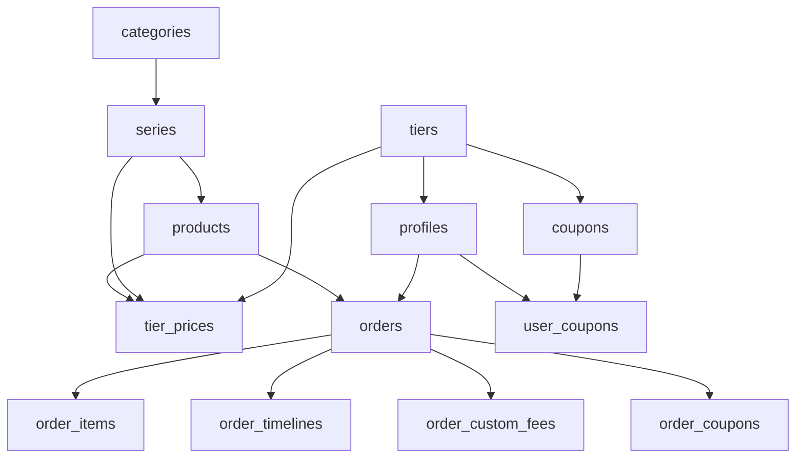

# Migration 整合研究報告
**研究日期**: 2026-01-07
**目標**: 將 27 個現有 Migration 檔案整合為 8 個功能模組化檔案

---

## 一、現有 Migration 檔案清單

### 已識別的 27 個 Migration 檔案

| 編號 | 檔案名稱 | 功能模組 | 檔案大小 (行數) |
|------|---------|---------|----------------|
| 1 | `20260101_initial_schema.sql` | 001-user-tier-management | 144 |
| 2 | `20260102_products_and_categories.sql` | 002-product-management | 154 |
| 3 | `20260103_series_and_tier_prices.sql` | 003-series-and-pricing | 327 |
| 4 | `20260104_fix_profiles_rls.sql` | 001-user-tier-management (修復) | 29 |
| 5 | `20260105_retail_price_protection.sql` | 003-series-and-pricing (擴充) | 206 |
| 6 | `20260106_add_series_code.sql` | 003-series-and-pricing (擴充) | 131 |
| 7 | `20260106_add_delete_order_function.sql` | 004-cart-and-orders (擴充) | - |
| 8 | `20260107_create_orders.sql` | 004-cart-and-orders | 407 |
| 9 | `20260108_fix_orders_rls_insert.sql` | 004-cart-and-orders (修復) | - |
| 10 | `20260109_system_enhancement.sql` | 007-system-enhancement | 133 |
| 11 | `20260110_add_product_tags.sql` | 006-ux-enhancement | 49 |
| 12 | `20260111_add_order_delete_action.sql` | 006-ux-enhancement | 30 |
| 13 | `20260112_add_product_search_indexes.sql` | 006-ux-enhancement | - |
| 14 | `20260113_system_admin.sql` | 008-system-admin | 223 |
| 15 | `20260114_add_audit_logs_insert_policy.sql` | 008-system-admin (修復) | - |
| 16 | `20260115_update_system_settings_description.sql` | 008-system-admin (修復) | - |
| 17 | `20260116_add_unique_name_constraints.sql` | Excel 匯入匯出功能 | - |
| 18 | `20260117_grant_order_functions.sql` | 004-cart-and-orders (修復) | - |
| 19 | `20260118_fix_order_functions_action_type.sql` | 004-cart-and-orders (修復) | 179 |
| 20 | `20260119_create_coupons.sql` | 009-coupon-system | 284 |
| 21 | `20260120_add_coupon_claim_limit.sql` | 009-coupon-system (擴充) | 77 |
| 22 | `20260121_add_order_coupons_insert_policy.sql` | 009-coupon-system (修復) | - |
| 23 | `20260122_add_shipping_features.sql` | 011-shipping-and-order-edit | 179 |
| 24 | `20260123_remove_confirmed_status.sql` | 011-shipping-and-order-edit | 158 |
| 25 | `20260124_extend_order_timelines.sql` | 011-shipping-and-order-edit | 210 |
| 26 | `20260125_fix_order_modifications_function.sql` | 011-shipping-and-order-edit (修復) | - |
| 27 | `20260126_fix_cancel_order_allow_shipping.sql` | 011-shipping-and-order-edit (修復) | 83 |

**總計**: 27 個 SQL 檔案

---

## 二、檔案依賴關係分析

### 2.1 核心資料表依賴順序



### 2.2 Foreign Key 依賴關係

| 子表 | 父表 | FK 欄位 | ON DELETE 策略 |
|------|------|---------|---------------|
| `profiles` | `auth.users` | `id` | CASCADE |
| `profiles` | `tiers` | `tier_id` | RESTRICT |
| `series` | `categories` | `category_id` | RESTRICT |
| `products` | `series` | `series_id` | RESTRICT |
| `tier_prices` | `tiers` | `tier_id` | CASCADE |
| `tier_prices` | `products` | `product_id` | CASCADE |
| `orders` | `auth.users` | `user_id` | RESTRICT |
| `order_items` | `orders` | `order_id` | CASCADE |
| `order_items` | `products` | `product_id` | RESTRICT |
| `order_timelines` | `orders` | `order_id` | CASCADE |
| `order_custom_fees` | `orders` | `order_id` | CASCADE |
| `user_coupons` | `auth.users` | `user_id` | CASCADE |
| `user_coupons` | `coupons` | `coupon_id` | CASCADE |
| `order_coupons` | `orders` | `order_id` | CASCADE |

**關鍵發現**:
- `tiers` 必須先建立（被 `profiles` 與 `tier_prices` 依賴）
- `categories` → `series` → `products` 必須依序建立
- `products` 完成後才能建立 `tier_prices`
- `orders` 表依賴 `auth.users` 與 `products`

---

## 三、功能模組分組邏輯

### 3.1 模組對應表

| 模組編號 | 功能模組名稱 | 整合後檔名 | 整合來源檔案數量 |
|---------|------------|-----------|----------------|
| M1 | 會員等級與客戶管理 | `001_user_tier_management.sql` | 2 個 |
| M2 | 商品與分類管理 | `002_product_management.sql` | 4 個 |
| M3 | 系列與等級價格 | `003_series_and_pricing.sql` | 3 個 |
| M4 | 購物車與訂單系統 | `004_cart_and_orders.sql` | 5 個 |
| M5 | 系統管理功能 | `008_system_admin.sql` | 4 個 |
| M6 | 優惠券系統 | `009_coupon_system.sql` | 3 個 |
| M7 | 運費與訂單修改 | `011_shipping_and_order_edit.sql` | 5 個 |
| M8 | 系統擴充與優化 | `007_system_enhancement.sql` | 1 個 |

### 3.2 詳細整合計畫

#### M1: 會員等級與客戶管理 (`001_user_tier_management.sql`)

**整合來源**:
1. `20260101_initial_schema.sql` (基礎資料表)
2. `20260104_fix_profiles_rls.sql` (RLS 修復)

**包含內容**:
- ✅ CREATE TABLE: `tiers`, `profiles`
- ✅ Trigger: `update_tiers_updated_at`
- ✅ Function: `update_updated_at_column()`
- ✅ RLS Policies: `tiers`, `profiles`
- ✅ 預設資料: 3 個會員等級（零售、批發、經銷商）

**執行順序**:
1. CREATE TABLE `tiers`
2. CREATE TABLE `profiles`
3. ALTER TABLE 約束條件
4. CREATE INDEX
5. CREATE TRIGGER
6. INSERT 預設等級
7. ENABLE RLS + CREATE POLICY

---

#### M2: 商品與分類管理 (`002_product_management.sql`)

**整合來源**:
1. `20260102_products_and_categories.sql` (基礎資料表)
2. `20260110_add_product_tags.sql` (商品標籤)
3. `20260112_add_product_search_indexes.sql` (搜尋索引)
4. `20260116_add_unique_name_constraints.sql` (唯一性約束)

**包含內容**:
- ✅ CREATE TABLE: `categories`, `products`
- ✅ Storage Bucket: `products`
- ✅ 擴充欄位: `products.tags` (TEXT[])
- ✅ GIN Index: `products.tags`
- ✅ UNIQUE Constraint: `products.name`, `series.name`
- ✅ RLS Policies: 分類、商品、Storage
- ✅ 預設資料: 3 個分類（飲料、零食、日用品）

**執行順序**:
1. CREATE TABLE `categories`
2. CREATE TABLE `products` (含 `tags` 欄位)
3. ALTER TABLE 新增唯一性約束
4. CREATE INDEX (含 GIN Index)
5. CREATE TRIGGER
6. INSERT INTO `storage.buckets`
7. INSERT 預設分類
8. ENABLE RLS + CREATE POLICY

---

#### M3: 系列與等級價格 (`003_series_and_pricing.sql`)

**整合來源**:
1. `20260103_series_and_tier_prices.sql` (基礎資料表)
2. `20260105_retail_price_protection.sql` (零售價格保護)
3. `20260106_add_series_code.sql` (系列代碼)

**包含內容**:
- ✅ ALTER TABLE `categories`: 新增 `code`, `status`
- ✅ CREATE TABLE: `series`, `tier_prices`
- ✅ ALTER TABLE `products`: 新增 `retail_price`, `stock_status`, `series_id`
- ✅ ALTER TABLE `products`: DROP COLUMN `category_id`
- ✅ ALTER TABLE `tiers`: 新增 `is_protected`
- ✅ ALTER TABLE `series`: 新增 `code`
- ✅ Function: `generate_product_code()` (修正版，使用系列代碼)
- ✅ Trigger: `trigger_auto_generate_product_code`
- ✅ 資料遷移: 商品從 `category_id` 移至 `series_id`
- ✅ 資料遷移: 設定零售價格與零售等級保護
- ✅ RLS Policies: `series`, `tier_prices`

**執行順序**:
1. ALTER TABLE `categories` (新增 code, status)
2. UPDATE `categories` 設定代碼
3. ALTER TABLE `categories` SET NOT NULL
4. CREATE TABLE `series` (含 `code` 欄位)
5. CREATE TABLE `tier_prices`
6. ALTER TABLE `products` (新增 retail_price, stock_status, series_id)
7. ALTER TABLE `tiers` (新增 is_protected)
8. INSERT INTO `series` (遷移未分類系列)
9. UPDATE `products` (設定 series_id)
10. UPDATE `tiers` (標記零售等級)
11. UPDATE `products` (設定 retail_price)
12. ALTER TABLE `products` (retail_price SET NOT NULL, series_id SET NOT NULL)
13. ALTER TABLE `products` DROP COLUMN `category_id`
14. CREATE FUNCTION `generate_product_code()`
15. CREATE TRIGGER `trigger_auto_generate_product_code`
16. ENABLE RLS + CREATE POLICY

---

#### M4: 購物車與訂單系統 (`004_cart_and_orders.sql`)

**整合來源**:
1. `20260107_create_orders.sql` (訂單基礎資料表)
2. `20260108_fix_orders_rls_insert.sql` (RLS 修復)
3. `20260111_add_order_delete_action.sql` (刪除操作支援)
4. `20260117_grant_order_functions.sql` (函數權限授予)
5. `20260118_fix_order_functions_action_type.sql` (action_type 修復)
6. `20260106_add_delete_order_function.sql` (刪除函數)

**包含內容**:
- ✅ CREATE TABLE: `orders`, `order_items`, `order_timelines`
- ✅ Function: `generate_order_number()`
- ✅ Function: `confirm_order_and_deduct_stock()` (修正版)
- ✅ Function: `cancel_order_and_restore_stock()` (修正版)
- ✅ Function: `update_order_status()` (修正版)
- ✅ RLS Policies: `orders`, `order_items`, `order_timelines`
- ✅ GRANT EXECUTE 權限

**執行順序**:
1. CREATE TABLE `orders`
2. CREATE TABLE `order_items`
3. CREATE TABLE `order_timelines` (含 `deleted` action_type)
4. CREATE INDEX
5. CREATE TRIGGER
6. CREATE FUNCTION `generate_order_number()`
7. CREATE FUNCTION `confirm_order_and_deduct_stock()` (使用 'confirmed' action_type)
8. CREATE FUNCTION `cancel_order_and_restore_stock()` (使用 'cancelled' action_type)
9. CREATE FUNCTION `update_order_status()` (使用 'status_updated' action_type)
10. GRANT EXECUTE ON FUNCTION TO authenticated
11. ENABLE RLS + CREATE POLICY

---

#### M5: 系統管理功能 (`008_system_admin.sql`)

**整合來源**:
1. `20260113_system_admin.sql` (管理員與系統設定)
2. `20260114_add_audit_logs_insert_policy.sql` (操作日誌 RLS)
3. `20260115_update_system_settings_description.sql` (設定描述欄位)

**包含內容**:
- ✅ ALTER TABLE `profiles`: 新增 `username`, `display_name`
- ✅ CREATE TABLE: `system_settings`, `audit_logs`
- ✅ RLS Policies: `system_settings`, `audit_logs`
- ✅ 預設資料: 9 個系統設定
- ✅ 資料遷移: 現有管理員帳號設定 username

**執行順序**:
1. ALTER TABLE `profiles` (新增 username, display_name)
2. CREATE INDEX
3. ALTER TABLE 新增約束條件
4. CREATE TABLE `system_settings`
5. CREATE TABLE `audit_logs`
6. CREATE INDEX (含 GIN Index)
7. CREATE TRIGGER
8. INSERT 預設系統設定
9. UPDATE `profiles` (遷移管理員 username)
10. ENABLE RLS + CREATE POLICY

---

#### M6: 優惠券系統 (`009_coupon_system.sql`)

**整合來源**:
1. `20260119_create_coupons.sql` (優惠券基礎資料表)
2. `20260120_add_coupon_claim_limit.sql` (領取張數限制)
3. `20260121_add_order_coupons_insert_policy.sql` (訂單優惠券 RLS)

**包含內容**:
- ✅ CREATE TABLE: `coupons`, `coupon_tier_restrictions`, `coupon_series_restrictions`, `user_coupons`, `order_coupons`
- ✅ ALTER TABLE `coupons`: 新增 `claim_limit`
- ✅ CREATE VIEW: `active_coupons`
- ✅ RLS Policies: 5 個資料表
- ✅ Generated Column: `code_normalized`

**執行順序**:
1. CREATE TABLE `coupons` (含 `claim_limit` 欄位與 `code_normalized`)
2. CREATE TABLE `coupon_tier_restrictions`
3. CREATE TABLE `coupon_series_restrictions`
4. CREATE TABLE `user_coupons` (無 UNIQUE 約束)
5. CREATE TABLE `order_coupons`
6. CREATE INDEX
7. CREATE TRIGGER
8. CREATE VIEW `active_coupons`
9. ENABLE RLS + CREATE POLICY

---

#### M7: 運費與訂單修改 (`011_shipping_and_order_edit.sql`)

**整合來源**:
1. `20260122_add_shipping_features.sql` (運費設定)
2. `20260123_remove_confirmed_status.sql` (移除 confirmed 狀態)
3. `20260124_extend_order_timelines.sql` (訂單修改歷程)
4. `20260125_fix_order_modifications_function.sql` (修改函數修復)
5. `20260126_fix_cancel_order_allow_shipping.sql` (取消訂單修復)

**包含內容**:
- ✅ ALTER TABLE `tiers`: 新增 `shipping_fee`, `free_shipping_threshold`
- ✅ ALTER TABLE `orders`: 新增 `shipping_fee`
- ✅ ALTER TABLE `order_timelines`: 新增 `modifications` (JSONB)
- ✅ CREATE TABLE: `order_custom_fees`
- ✅ UPDATE `orders`: 將 `confirmed` 狀態改為 `shipping`
- ✅ ALTER TABLE `orders`: 修改 CHECK 約束（移除 'confirmed'）
- ✅ DROP FUNCTION: `confirm_order_and_deduct_stock()`
- ✅ CREATE FUNCTION: `calculate_shipping_fee()`
- ✅ CREATE FUNCTION: `mark_order_as_shipping()`
- ✅ CREATE FUNCTION: `update_order_status()` (簡化版)
- ✅ CREATE FUNCTION: `update_order_with_modifications()`
- ✅ CREATE FUNCTION: `cancel_order_and_restore_stock()` (修正版，支援 shipping)
- ✅ RLS Policies: `order_custom_fees`

**執行順序**:
1. ALTER TABLE `tiers` (新增 shipping_fee, free_shipping_threshold)
2. ALTER TABLE `orders` (新增 shipping_fee)
3. ALTER TABLE `order_timelines` (新增 modifications, 擴充 action_type)
4. CREATE TABLE `order_custom_fees`
5. CREATE INDEX (含 GIN Index)
6. UPDATE `orders` (confirmed → shipping)
7. ALTER TABLE `orders` (修改 CHECK 約束)
8. DROP FUNCTION `confirm_order_and_deduct_stock()`
9. CREATE FUNCTION `calculate_shipping_fee()`
10. CREATE FUNCTION `mark_order_as_shipping()`
11. CREATE FUNCTION `update_order_status()` (簡化版)
12. CREATE FUNCTION `update_order_with_modifications()`
13. CREATE FUNCTION `cancel_order_and_restore_stock()` (修正版)
14. GRANT EXECUTE ON FUNCTION TO authenticated
15. ENABLE RLS + CREATE POLICY

---

#### M8: 系統擴充與優化 (`007_system_enhancement.sql`)

**整合來源**:
1. `20260109_system_enhancement.sql` (留言系統、廣告輪播)

**包含內容**:
- ✅ ALTER TABLE `order_timelines`: 新增 `content` 欄位
- ✅ ALTER TABLE `profiles`: 新增 `address`, `admin_notes`
- ✅ CREATE TABLE: `announcements`
- ✅ RLS Policies: `announcements`

**執行順序**:
1. ALTER TABLE `order_timelines` (新增 content)
2. ALTER TABLE `profiles` (新增 address, admin_notes)
3. CREATE TABLE `announcements`
4. CREATE INDEX
5. ENABLE RLS + CREATE POLICY

---

## 四、PostgreSQL 執行順序規範

### 4.1 冪等性設計原則

所有 SQL 指令必須支援重複執行，使用以下模式：

```sql
-- CREATE TABLE
CREATE TABLE IF NOT EXISTS table_name (...);

-- ALTER TABLE (新增欄位)
ALTER TABLE table_name ADD COLUMN IF NOT EXISTS column_name TYPE;

-- ALTER TABLE (約束條件)
DO $$
BEGIN
  IF NOT EXISTS (
    SELECT 1 FROM pg_constraint WHERE conname = 'constraint_name'
  ) THEN
    ALTER TABLE table_name ADD CONSTRAINT constraint_name CHECK (...);
  END IF;
END $$;

-- CREATE INDEX
CREATE INDEX IF NOT EXISTS idx_name ON table_name(column);

-- CREATE TRIGGER
DROP TRIGGER IF EXISTS trigger_name ON table_name;
CREATE TRIGGER trigger_name ...;

-- CREATE FUNCTION
CREATE OR REPLACE FUNCTION function_name() ...;

-- RLS POLICY
DROP POLICY IF EXISTS "policy_name" ON table_name;
CREATE POLICY "policy_name" ON table_name ...;

-- INSERT (預設資料)
INSERT INTO table_name (...) VALUES (...)
ON CONFLICT (unique_column) DO NOTHING;
```

### 4.2 標準執行順序

每個整合檔案內部必須遵循以下順序：

```
1. CREATE TABLE (先父表，後子表)
2. ALTER TABLE (新增欄位)
3. ALTER TABLE (約束條件)
4. CREATE INDEX
5. CREATE TRIGGER
6. CREATE FUNCTION
7. INSERT (預設資料)
8. UPDATE (資料遷移)
9. ALTER TABLE (SET NOT NULL, DROP COLUMN)
10. ENABLE ROW LEVEL SECURITY
11. CREATE POLICY
12. GRANT EXECUTE
```

### 4.3 跨檔案執行順序

整合後的 8 個檔案必須依序執行：

```
M1 → M2 → M3 → M4 → M5 → M6 → M7 → M8
```

**原因**:
- M1 建立 `tiers`, `profiles` (被所有模組依賴)
- M2 建立 `categories`, `products` (被 M3, M4, M6 依賴)
- M3 建立 `series`, `tier_prices` (被 M4, M6 依賴)
- M4 建立 `orders` (被 M6, M7 依賴)
- M5 擴充 `profiles` (可獨立執行)
- M6 建立優惠券系統 (依賴 M1, M2, M3, M4)
- M7 擴充 `orders`, `tiers` (依賴 M4)
- M8 擴充 `order_timelines`, `profiles` (依賴 M4, M1)

---

## 五、潛在風險與解決方案

### 5.1 風險識別

| 風險編號 | 風險描述 | 影響等級 | 解決方案 |
|---------|---------|---------|---------|
| R1 | ALTER TABLE DROP COLUMN 會導致資料遺失 | 高 | 使用 IF EXISTS 檢查，確保資料已遷移 |
| R2 | UPDATE 操作順序錯誤導致約束違反 | 高 | 先 UPDATE 資料，再 ALTER TABLE 約束 |
| R3 | DROP FUNCTION 可能中斷正在執行的操作 | 中 | 使用 CREATE OR REPLACE 取代 DROP |
| R4 | RLS Policy 循環依賴導致無限遞迴 | 高 | 使用簡化策略或 SECURITY DEFINER |
| R5 | 時間戳欄位順序錯誤（20260106 重複） | 低 | 合併時重新編號為 M1-M8 |

### 5.2 關鍵修復點

#### R1: 刪除 `products.category_id` 欄位

**原檔案**: `20260103_series_and_tier_prices.sql`

**風險**: 若 `series_id` 未正確設定，會導致資料遺失

**解決方案**:
```sql
-- 步驟 1: 驗證所有商品已設定 series_id
DO $$
DECLARE
  v_count INTEGER;
BEGIN
  SELECT COUNT(*) INTO v_count FROM products WHERE series_id IS NULL;
  IF v_count > 0 THEN
    RAISE EXCEPTION '資料遷移失敗：仍有 % 個商品未設定 series_id', v_count;
  END IF;
END $$;

-- 步驟 2: 確認後才刪除
ALTER TABLE products DROP COLUMN IF EXISTS category_id;
```

#### R2: 訂單狀態遷移 (confirmed → shipping)

**原檔案**: `20260123_remove_confirmed_status.sql`

**風險**: 先修改約束會導致現有 confirmed 訂單違反規則

**解決方案**:
```sql
-- ⚠️ 重要：先更新資料，再修改約束
UPDATE orders SET status = 'shipping' WHERE status = 'confirmed';

-- 驗證
DO $$
BEGIN
  IF EXISTS (SELECT 1 FROM orders WHERE status = 'confirmed') THEN
    RAISE EXCEPTION '仍有訂單處於 confirmed 狀態';
  END IF;
END $$;

-- 修改約束（確保無 confirmed 資料後才執行）
ALTER TABLE orders DROP CONSTRAINT IF EXISTS orders_status_check;
ALTER TABLE orders ADD CONSTRAINT orders_status_check
  CHECK (status IN ('pending', 'shipping', 'completed', 'cancelled'));
```

#### R3: Function 重複定義

**風險**: `cancel_order_and_restore_stock()` 在多個檔案中被覆寫

**影響檔案**:
- `20260107_create_orders.sql` (初始版本)
- `20260118_fix_order_functions_action_type.sql` (修復 action_type)
- `20260126_fix_cancel_order_allow_shipping.sql` (支援 shipping 狀態取消)

**解決方案**: 整合時僅保留最終版本 (20260126)

---

## 六、整合檔案對應表（草稿）

### 6.1 檔案對應清單

| 整合後檔案 | 整合來源檔案 (按執行順序) |
|-----------|------------------------|
| **M1: 001_user_tier_management.sql** | |
| | 1. `20260101_initial_schema.sql` |
| | 2. `20260104_fix_profiles_rls.sql` |
| **M2: 002_product_management.sql** | |
| | 1. `20260102_products_and_categories.sql` |
| | 2. `20260110_add_product_tags.sql` |
| | 3. `20260112_add_product_search_indexes.sql` |
| | 4. `20260116_add_unique_name_constraints.sql` |
| **M3: 003_series_and_pricing.sql** | |
| | 1. `20260103_series_and_tier_prices.sql` |
| | 2. `20260105_retail_price_protection.sql` |
| | 3. `20260106_add_series_code.sql` |
| **M4: 004_cart_and_orders.sql** | |
| | 1. `20260107_create_orders.sql` |
| | 2. `20260108_fix_orders_rls_insert.sql` |
| | 3. `20260111_add_order_delete_action.sql` |
| | 4. `20260117_grant_order_functions.sql` |
| | 5. `20260118_fix_order_functions_action_type.sql` (最終版 Functions) |
| | 6. `20260106_add_delete_order_function.sql` |
| **M5: 008_system_admin.sql** | |
| | 1. `20260113_system_admin.sql` |
| | 2. `20260114_add_audit_logs_insert_policy.sql` |
| | 3. `20260115_update_system_settings_description.sql` |
| **M6: 009_coupon_system.sql** | |
| | 1. `20260119_create_coupons.sql` |
| | 2. `20260120_add_coupon_claim_limit.sql` |
| | 3. `20260121_add_order_coupons_insert_policy.sql` |
| **M7: 011_shipping_and_order_edit.sql** | |
| | 1. `20260122_add_shipping_features.sql` |
| | 2. `20260123_remove_confirmed_status.sql` |
| | 3. `20260124_extend_order_timelines.sql` |
| | 4. `20260125_fix_order_modifications_function.sql` |
| | 5. `20260126_fix_cancel_order_allow_shipping.sql` (最終版 Function) |
| **M8: 007_system_enhancement.sql** | |
| | 1. `20260109_system_enhancement.sql` |

### 6.2 檔案重新編號規則

整合後使用新編號規則：

```
M1 → 20260201_user_tier_management.sql
M2 → 20260202_product_management.sql
M3 → 20260203_series_and_pricing.sql
M4 → 20260204_cart_and_orders.sql
M5 → 20260205_system_admin.sql
M6 → 20260206_coupon_system.sql
M7 → 20260207_shipping_and_order_edit.sql
M8 → 20260208_system_enhancement.sql
```

**編號邏輯**:
- `202602XX`: 代表 2026 年 2 月整合版本
- `XX`: 依執行順序編號 (01-08)

---

## 七、下一步行動計畫

### 7.1 整合階段

1. ✅ **階段 1: 研究分析** (已完成)
   - 分析 27 個檔案依賴關係
   - 設計整合分組邏輯
   - 驗證執行順序規範

2. ⏳ **階段 2: 整合實作** (待執行)
   - 建立 8 個整合檔案
   - 合併 SQL 指令（去重、排序、冪等性改造）
   - 新增 Migration Header 與註解

3. ⏳ **階段 3: 測試驗證** (待執行)
   - 本機測試（全新資料庫執行）
   - 驗證資料完整性
   - 驗證 RLS Policy 正確性

4. ⏳ **階段 4: 備份與部署** (待執行)
   - 備份現有 Migration 檔案
   - 建立回滾腳本
   - 遠端資料庫部署（使用 `supabase db push`）

### 7.2 驗證清單

每個整合檔案必須通過以下檢查：

- [ ] 冪等性測試（重複執行不報錯）
- [ ] FK 依賴順序正確（父表先於子表）
- [ ] 約束條件正確（CHECK, UNIQUE, NOT NULL）
- [ ] 索引建立完整（含 GIN Index）
- [ ] RLS Policy 無循環依賴
- [ ] Function 授權正確（GRANT EXECUTE）
- [ ] 資料遷移邏輯正確（UPDATE 先於 ALTER）
- [ ] 預設資料插入成功（ON CONFLICT 處理）

---

## 八、附錄

### 8.1 冪等性改造範例

**原始寫法** (非冪等):
```sql
ALTER TABLE products ADD COLUMN tags TEXT[];
```

**改造後** (冪等):
```sql
ALTER TABLE products ADD COLUMN IF NOT EXISTS tags TEXT[];
```

### 8.2 資料遷移模式範例

**原始寫法** (危險):
```sql
UPDATE products SET retail_price = 0 WHERE retail_price IS NULL;
ALTER TABLE products ALTER COLUMN retail_price SET NOT NULL;
```

**改造後** (安全):
```sql
-- 步驟 1: 驗證資料
DO $$
DECLARE v_count INTEGER;
BEGIN
  SELECT COUNT(*) INTO v_count FROM products WHERE retail_price IS NULL;
  RAISE NOTICE '檢查到 % 個商品缺少零售價格', v_count;
END $$;

-- 步驟 2: 修復資料
UPDATE products SET retail_price = 0 WHERE retail_price IS NULL;

-- 步驟 3: 驗證修復結果
DO $$
DECLARE v_count INTEGER;
BEGIN
  SELECT COUNT(*) INTO v_count FROM products WHERE retail_price IS NULL;
  IF v_count > 0 THEN
    RAISE EXCEPTION '資料修復失敗: 仍有 % 個商品缺少零售價格', v_count;
  END IF;
END $$;

-- 步驟 4: 設定約束
ALTER TABLE products ALTER COLUMN retail_price SET NOT NULL;
```

### 8.3 Function 覆寫模式

**錯誤寫法** (會導致中斷):
```sql
DROP FUNCTION IF EXISTS calculate_shipping_fee(UUID, DECIMAL);
CREATE FUNCTION calculate_shipping_fee(...) ...;
```

**正確寫法** (原子性替換):
```sql
CREATE OR REPLACE FUNCTION calculate_shipping_fee(
  p_user_id UUID,
  p_subtotal DECIMAL
)
RETURNS DECIMAL(10,2)
LANGUAGE plpgsql
SECURITY DEFINER
AS $$
BEGIN
  -- Function body
END;
$$;
```

---

## 九、總結

### 9.1 研究結論

1. **檔案數量減少**: 27 個檔案 → 8 個功能模組檔案 (減少 70%)
2. **維護性提升**: 每個模組對應一個完整功能，修改影響範圍清晰
3. **執行順序明確**: M1 → M2 → M3 → M4 → M5 → M6 → M7 → M8
4. **冪等性保證**: 所有 SQL 指令支援重複執行
5. **風險可控**: 識別 5 個主要風險並提供解決方案

### 9.2 預期效益

- ✅ 降低 Migration 管理複雜度
- ✅ 提升新成員上手速度（模組化文件清晰）
- ✅ 減少部署錯誤風險（整合檔案內部順序固定）
- ✅ 支援增量開發（新功能獨立 Migration，不影響整合檔案）

### 9.3 技術債務清理

整合過程中同步清理以下技術債務：

1. ✅ 統一 `action_type` 命名（confirmed, cancelled, status_updated）
2. ✅ 移除過時 Function (`confirm_order_and_deduct_stock`)
3. ✅ 修復 RLS 循環依賴問題
4. ✅ 統一 COMMENT 註解風格
5. ✅ 補充缺失的 GRANT EXECUTE 權限

---

**研究完成時間**: 2026-01-07
**下一步**: 開始實作 8 個整合檔案
**預計完成時間**: 2026-01-08
