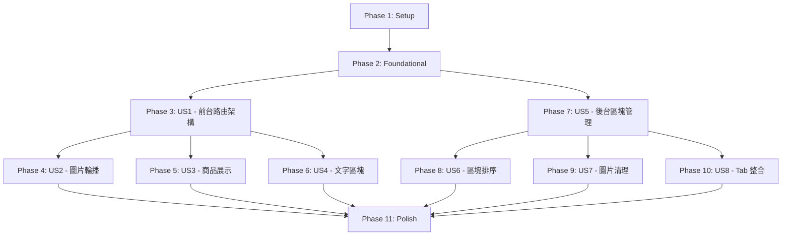

# Implementation Tasks: 首頁廣告區塊系統

**Feature**: 016-home-page-blocks | **Generated**: 2026-01-13 (Updated) | **Status**: Ready for Re-Implementation

**⚠️ IMPORTANT**: This task list reflects the **new design** with block type locking. Previous implementation used a unified form with type dropdown, which is **no longer valid**.

---

## Task Summary

| Phase | Description | Tasks | Completed |
|-------|-------------|-------|-----------|
| **Phase 1** | Setup & Infrastructure | 6 | 0/6 |
| **Phase 2** | Foundational (Blocking Prerequisites) | 8 | 0/8 |
| **Phase 3** | US1 - 前台路由與導覽切換 | 7 | 0/7 |
| **Phase 4** | US2 - 圖片輪播區塊 | 5 | 0/5 |
| **Phase 5** | US3 - 商品展示區塊 | 5 | 0/5 |
| **Phase 6** | US4 - 文字區塊 | 3 | 0/3 |
| **Phase 7** | US5 - 管理員建立與管理首頁廣告區塊 | 15 | 0/15 |
| **Phase 8** | US6 - 管理員調整區塊排序 | 4 | 0/4 |
| **Phase 9** | US7 - 圖片清理與資料一致性 | 6 | 0/6 |
| **Phase 10** | US8 - 後台廣告管理整合與 Tab 切換 | 3 | 0/3 |
| **Phase 11** | Polish & Quality Assurance | 8 | 0/8 |
| **Total** | | **70** | **0/70** |

---

## Phase 1: Setup & Infrastructure

**Goal**: 初始化專案環境，建立資料庫結構基礎。

**Prerequisites**: None (blocking phase for all user stories)

### Tasks

- [ ] T000 [CRITICAL] Execute Migration safety check: run `pnpm db:migrate:preview` to preview changes, confirm no destructive operations (DROP TABLE/COLUMN), and execute backup if in production environment (follows Database Safety Protocol from CLAUDE.md)
- [ ] T001 Create database migration file at supabase/migrations/20260113_home_page_blocks.sql with table schema, indexes, triggers, RLS policies, and comments
- [ ] T002 Execute database migration using pnpm db:migrate and verify table creation in Supabase dashboard (verify home_page_blocks table exists, RLS enabled, indexes created)
- [ ] T003 [P] Update types/index.ts to add BlockType, ImageCarouselConfig, ProductDisplayConfig, TextBlockConfig, and HomePageBlock type definitions
- [ ] T004 [P] Create lib/validations/home-block.schema.ts with Zod schemas for all three block types using discriminated union
- [ ] T004a [P] Verify JSONB Config default values and NULL handling logic for all three block types (optional fields must use .optional() or .nullable(), required fields must have default values documented)

**Acceptance Criteria**:
- ✅ home_page_blocks table exists with all columns and constraints
- ✅ Indexes idx_home_blocks_active_sort and idx_home_blocks_type are created
- ✅ RLS policies are enabled and working correctly
- ✅ TypeScript types compile without errors
- ✅ Zod schemas validate all three block types correctly
- ✅ JSONB Config default values documented and tested (e.g., auto_play defaults to true, interval_ms defaults to 5000)

---

## Phase 2: Foundational (Blocking Prerequisites)

**Goal**: 實作所有 User Story 共用的基礎設施。

**Prerequisites**: Phase 1

### Tasks

- [ ] T005 [P] Create lib/actions/home-blocks.ts with getActiveHomeBlocks() Server Action calling checkAuth() and querying home_page_blocks WHERE is_active = true ORDER BY sort_order
- [ ] T006 [P] Implement getAllHomeBlocks() Server Action in lib/actions/home-blocks.ts with checkAuth('admin') querying all blocks ORDER BY sort_order
- [ ] T007 [P] Implement getHomeBlockById(id) Server Action in lib/actions/home-blocks.ts with checkAuth('admin') for editing use case
- [ ] T008 [P] Implement createHomeBlock(data) Server Action in lib/actions/home-blocks.ts with Zod validation, checkAuth('admin'), and revalidatePath('/admin/home-blocks')
- [ ] T009 [P] Implement updateHomeBlock(id, data) Server Action in lib/actions/home-blocks.ts with Zod validation, checkAuth('admin'), **block_type change prevention**, and revalidatePath
- [ ] T010 [P] Implement deleteHomeBlock(id) Server Action in lib/actions/home-blocks.ts with checkAuth('admin'), image cleanup call, and revalidatePath
- [ ] T011 [P] Implement getProductsByBlockConfig(config) Server Action in lib/actions/home-blocks.ts querying products by series_ids and tag_ids with AND logic and user tier price lookup
- [ ] T012 [P] Create components/admin/home-blocks/ directory structure for all admin components

**Acceptance Criteria**:
- ✅ All Server Actions properly implement checkAuth() and handle errors
- ✅ createHomeBlock() and updateHomeBlock() validate input with Zod schemas
- ✅ updateHomeBlock() prevents block_type changes (returns error if attempted)
- ✅ getProductsByBlockConfig() correctly filters products by series AND tags
- ✅ All Server Actions return ActionResult<T> format
- ✅ RLS policies allow admin to perform all operations

---

## Phase 3: US1 - 前台路由與導覽切換

**Goal**: 客戶進入前台後，可以在「首頁」和「商品頁」之間切換，首頁顯示廣告區塊，商品頁顯示系列與商品列表。

**Priority**: P0

**Prerequisites**: Phase 1, Phase 2

**Independent Test**: 客戶可以從 `/store` 自動導向首頁，使用 Segment Control 切換到商品頁，兩個頁面都顯示歡迎字樣與會員等級。

### Tasks

- [ ] T013 [US1] Update app/(shop)/store/page.tsx to add permanent redirect (HTTP 301) from /store to /store/home using Next.js redirect() function
- [ ] T014 [US1] Create app/(shop)/store/home/page.tsx as new homepage displaying welcome message and calling getActiveHomeBlocks() to render block list
- [ ] T015 [US1] Move existing store product listing code from app/(shop)/store/page.tsx to new file app/(shop)/store/products/page.tsx
- [ ] T016 [US1] Create components/shop/home-blocks/SegmentControl.tsx with two buttons ("首頁" and "商品") using Next.js Link, active state styling (green background + Neo-Brutalism shadow), and minimum 44px touch target height
- [ ] T017 [US1] Update app/(shop)/layout.tsx to add SegmentControl component above main content area with current route detection using usePathname()
- [ ] T018 [US1] Add welcome message below SegmentControl in layout.tsx displaying "{用戶名} 您好！會員等級: {等級名稱}" using getUser() to fetch user profile and tier name
- [ ] T019 [US1] Test routing: verify /store redirects to /store/home (HTTP 301), SegmentControl highlights active tab, welcome message displays correctly, touch targets >= 44px on mobile

**Acceptance Criteria**:
- ✅ /store permanently redirects to /store/home (HTTP 301)
- ✅ SegmentControl highlights active tab with green background
- ✅ Welcome message displays user name and tier name
- ✅ Touch targets are >= 44px × 44px (WCAG 2.1 AA)
- ✅ Navigation between home and products works smoothly
- ✅ No layout shift when switching tabs

---

## Phase 4: US2 - 圖片輪播區塊

**Goal**: 客戶在首頁看到圖片輪播區塊，可以自動播放或手動切換圖片，點擊圖片可跳轉到指定系列頁面。

**Priority**: P0

**Prerequisites**: Phase 1, Phase 2, Phase 3 (US1 - 前台路由架構)

**Independent Test**: 客戶可以看到自動輪播的廣告圖片，點擊圖片下方的指示器切換圖片，點擊圖片本身跳轉到指定系列。

### Tasks

- [ ] T020 [US2] Create components/shop/home-blocks/ImageCarousel.tsx with image display, indicator dots, auto-play logic using useEffect + setInterval, and series link navigation
- [ ] T021 [US2] Implement manual image switching in ImageCarousel.tsx by clicking indicator dots with auto-play timer reset
- [ ] T022 [US2] Add responsive image sizing in ImageCarousel.tsx using Next.js Image component with h-64 (256px) on mobile and h-96 (384px) on desktop, and sizes="(max-width: 768px) 100vw, 50vw" for optimization
- [ ] T023 [US2] Apply Neo-Brutalism styling to ImageCarousel.tsx with black border (border-3), hard shadow (shadow-neo), and click effect (translate + shadow-none) on image
- [ ] T024 [US2] Test carousel: verify auto-play (5 second interval), manual switching via indicator dots, series link navigation, image does not navigate if series_id is null, responsive sizing works correctly

**Acceptance Criteria**:
- ✅ Images auto-play with 5 second interval (configurable)
- ✅ Clicking indicator dots switches image immediately and resets timer
- ✅ Clicking image navigates to series page if series_id is set
- ✅ Clicking image does nothing if series_id is null
- ✅ Responsive sizing: mobile 256px, desktop 384px
- ✅ Neo-Brutalism styling applied correctly

---

## Phase 5: US3 - 商品展示區塊

**Goal**: 客戶在首頁看到商品展示區塊，顯示指定系列或標籤的商品卡片，可左右滑動查看更多商品，點擊商品卡片跳轉到商品詳情頁。

**Priority**: P0

**Prerequisites**: Phase 1, Phase 2, Phase 3 (US1 - 前台路由架構)

**Independent Test**: 客戶可以看到商品卡片網格，左右滑動查看更多商品，點擊商品卡片跳轉到商品詳情頁。

### Tasks

- [ ] T025 [US3] Create components/shop/home-blocks/ProductDisplay.tsx calling getProductsByBlockConfig() with config.series_ids and config.tag_ids to fetch products with AND logic filtering
- [ ] T026 [US3] Implement responsive grid in ProductDisplay.tsx with 2 columns on mobile (grid-cols-2) and 3 columns on desktop (md:grid-cols-3) using CSS grid
- [ ] T027 [US3] Add horizontal scroll support in ProductDisplay.tsx using CSS scroll-snap-type: x mandatory and scroll-snap-align: start for smooth touch scrolling
- [ ] T028 [US3] Display scroll hint "← 左右滑動查看更多 →" in ProductDisplay.tsx when product count exceeds one row (conditional rendering based on item count and screen width)
- [ ] T029 [US3] Reuse components/shop/ProductWithPriceCard.tsx from 004-cart-and-orders to display each product with tier pricing and integrate with ProductDisplay.tsx grid

**Acceptance Criteria**:
- ✅ Products filtered by series AND tags (AND logic)
- ✅ Responsive grid: mobile 2 columns, desktop 3 columns
- ✅ Horizontal scroll works smoothly with CSS scroll-snap
- ✅ Scroll hint displayed only when products exceed one row
- ✅ ProductWithPriceCard displays tier pricing correctly
- ✅ Clicking product card navigates to product detail page

---

## Phase 6: US4 - 文字區塊

**Goal**: 客戶在首頁看到文字區塊，顯示管理員自訂的宣傳文字，支援自訂字體大小與顏色。

**Priority**: P1

**Prerequisites**: Phase 1, Phase 2, Phase 3 (US1 - 前台路由架構)

**Independent Test**: 客戶可以看到自訂字體大小與顏色的文字區塊。

### Tasks

- [ ] T030 [US4] Create components/shop/home-blocks/TextBlock.tsx displaying config.content with config.font_size (12px-48px) and config.color (Hex format #RRGGBB)
- [ ] T031 [US4] Implement responsive text sizing in TextBlock.tsx ensuring text width adapts to screen width (w-full) and text does not overflow (break-words)
- [ ] T032 [US4] Test text block: verify font size rendering (7 options: 12px, 16px, 20px, 24px, 32px, 40px, 48px), color rendering (Hex format), and responsive width on mobile and desktop

**Acceptance Criteria**:
- ✅ Text displays with correct font size (12px-48px)
- ✅ Text displays with correct color (Hex format #RRGGBB)
- ✅ Text width adapts to screen width without overflow
- ✅ All 7 font size options render correctly
- ✅ Content limited to 1000 characters (validated in form)

---

## Phase 7: US5 - 管理員建立與管理首頁廣告區塊

**Goal**: 管理員在後台建立首頁廣告區塊，**先選擇區塊類型（圖片輪播、商品展示、文字區塊）**，進入對應的設定表單後**不可變更區塊類型**，設定完成後可查看、編輯（不含類型變更）、刪除區塊。

**Priority**: P0

**Prerequisites**: Phase 1, Phase 2

**Independent Test**: 管理員可以先選擇區塊類型，進入對應表單設定所有參數，保存後在區塊列表中看到新建立的區塊，編輯時無法變更區塊類型。

### Tasks

- [ ] T033 [US5] Create components/admin/home-blocks/BlockTypeSelector.tsx dialog component with three buttons ("圖片輪播", "商品展示", "文字區塊") using shadcn Dialog or unified dialog system (013-unified-dialog), styled with Neo-Brutalism (green background, 3px black border, hard shadow)
- [ ] T034 [US5] Create app/(admin)/admin/home-blocks/new/page.tsx reading type query parameter (image_carousel / product_display / text_block) from URL and rendering corresponding form component, displaying error and redirecting to list if type is invalid
- [ ] T035 [US5] Create components/admin/home-blocks/ImageCarouselForm.tsx with fields: block name, image upload (max 5), auto_play toggle, interval_ms input, is_active toggle, **block type field hidden or read-only displaying "圖片輪播"**
- [ ] T036 [US5] Create components/admin/home-blocks/ProductDisplayForm.tsx with fields: block name, series dropdown (multi-select), tags dropdown (multi-select), max_items input, is_active toggle, **block type field hidden or read-only displaying "商品展示"**
- [ ] T037 [US5] Create components/admin/home-blocks/TextBlockForm.tsx with fields: block name, content textarea (max 1000 chars), font_size dropdown (7 options: 12px-48px), color picker (Hex format), is_active toggle, **block type field hidden or read-only displaying "文字區塊"**
- [ ] T038 [US5] Implement unsaved changes confirmation in all form components (ImageCarouselForm, ProductDisplayForm, TextBlockForm) using useEffect + beforeunload or React Router usePrompt to show dialog "尚未儲存的變更將遺失，確定要離開嗎？" when clicking "取消" or browser back button
- [ ] T039 [US5] Implement form submission in all three form components calling createHomeBlock() or updateHomeBlock() with Zod validation and revalidatePath, displaying success message using useAlert({ variant: 'success' }), and navigating to block list on success
- [ ] T040 [US5] Create app/(admin)/admin/home-blocks/[id]/edit/page.tsx calling getHomeBlockById() to fetch block data, rendering corresponding form component based on block_type, **block type field displayed as read-only (gray background, disabled state)**
- [ ] T041 [US5] Create components/admin/home-blocks/ImageUploadMultiple.tsx supporting upload of up to 5 images with preview, delete functionality, and series link selection per image (dropdown), file validation (JPG/PNG/WebP, max 5MB)
- [ ] T042 [US5] Implement uploadBlockImage(blockId, index, file) Server Action in lib/actions/home-blocks.ts with file validation (JPG/PNG/WebP, max 5MB), deleting old images at all extensions (.jpg/.png/.webp) before uploading new image to Supabase Storage at path home-page-blocks/{block_id}/image-{index}.{ext}
- [ ] T043 [US5] Create components/admin/home-blocks/HomeBlockCard.tsx displaying block thumbnail (first image for carousel), block name, block type badge, is_active status, edit button, and delete button with useConfirm({ variant: 'danger' }) confirmation
- [ ] T044 [US5] Create components/admin/home-blocks/HomeBlockList.tsx calling getAllHomeBlocks() to fetch all blocks, rendering HomeBlockCard components in grid layout, and "新增區塊" button triggering BlockTypeSelector dialog
- [ ] T045 [US5] Update "新增區塊" button in HomeBlockList.tsx to open BlockTypeSelector dialog, on type selection navigate to /admin/home-blocks/new?type={selected_type}
- [ ] T046 [US5] Test block type locking: verify BlockTypeSelector dialog displays correctly, type selection navigates to correct create page with type pre-set, editing shows type as read-only, unsaved changes confirmation works, form submission succeeds with validation
- [ ] T047 [US5] Test admin can create all 3 block types, upload images (carousel), select series/tags (display), set font size/color (text), edit all parameters except type, delete blocks with confirmation dialog, and see new block at top of list after creation

**Acceptance Criteria**:
- ✅ Clicking "新增區塊" opens BlockTypeSelector dialog with 3 type buttons
- ✅ Selecting type navigates to /admin/home-blocks/new?type={type}
- ✅ Create page renders correct form based on type query parameter
- ✅ Block type field is hidden or read-only in create forms
- ✅ Editing shows block type as read-only (gray background, disabled)
- ✅ Unsaved changes confirmation dialog works correctly
- ✅ Form submission creates/updates blocks with Zod validation
- ✅ Image upload supports up to 5 images with preview and delete
- ✅ File validation rejects invalid formats or oversized files (>5MB)
- ✅ Block list displays all blocks (including inactive) with thumbnails
- ✅ Edit and delete buttons work correctly with unified dialog confirmation
- ✅ New block appears at top of list after creation (sorted by sort_order)

---

## Phase 8: US6 - 管理員調整區塊排序

**Goal**: 管理員在後台調整首頁廣告區塊的顯示順序，前台按照管理員設定的順序顯示區塊。

**Priority**: P0

**Prerequisites**: Phase 1, Phase 2, Phase 7 (US5 - 區塊管理)

**Independent Test**: 管理員可以使用上移/下移按鈕調整區塊順序，前台立即反映順序變更。

### Tasks

- [ ] T048 [US6] Implement moveBlockUp(id) Server Action in lib/actions/home-blocks.ts swapping sort_order with previous block, calling checkAuth('admin'), and revalidatePath('/admin/home-blocks') and revalidatePath('/store/home')
- [ ] T049 [US6] Implement moveBlockDown(id) Server Action in lib/actions/home-blocks.ts swapping sort_order with next block, calling checkAuth('admin'), and revalidatePath
- [ ] T050 [US6] Add "向上移動" and "向下移動" buttons to components/admin/home-blocks/HomeBlockCard.tsx with Neo-Brutalism styling, disabling "向上移動" for first block (gray color, cursor-not-allowed) and "向下移動" for last block
- [ ] T051 [US6] Test sorting: verify up/down buttons swap block order correctly, disabled buttons for first/last blocks, frontend immediately reflects order changes after revalidatePath, and sorting persists after page refresh

**Acceptance Criteria**:
- ✅ Up/down buttons swap block sort_order correctly
- ✅ First block's up button is disabled (gray, cursor-not-allowed)
- ✅ Last block's down button is disabled
- ✅ Frontend updates immediately after sort change (revalidatePath)
- ✅ Block order persists after page refresh
- ✅ Admin can move blocks to any position

---

## Phase 9: US7 - 圖片清理與資料一致性

**Goal**: 系統在刪除或更換區塊圖片時，自動清理 Supabase Storage 中的舊圖片檔案，避免孤兒檔案殘留。

**Priority**: P0

**Prerequisites**: Phase 1, Phase 2, Phase 7 (US5 - 區塊管理)

**Independent Test**: 管理員刪除區塊或更換圖片後，Supabase Storage 中的舊圖片檔案被自動刪除。

### Tasks

- [ ] T052 [US7] Create lib/utils/block-image-cleanup.ts with deleteBlockImages(blockId, scenario, options) function supporting three cleanup scenarios: (1) Delete block - delete entire directory, (2) Replace image - delete specific index at all extensions, (3) Reduce count - delete excess images
- [ ] T053 [US7] Implement error handling in deleteBlockImages() with try-catch blocks, logging warnings for deletion failures (console.warn), but not throwing errors to avoid blocking main flow (follows容錯機制 from spec)
- [ ] T054 [US7] Update deleteHomeBlock() in lib/actions/home-blocks.ts to call deleteBlockImages(blockId, 'delete_block') before deleting database record if block_type is 'image_carousel', handling deletion failures gracefully
- [ ] T055 [US7] Update uploadBlockImage() in lib/actions/home-blocks.ts to call deleteBlockImages(blockId, 'replace_image', { index }) before uploading new image to ensure old image at all extensions (.jpg/.png/.webp) is deleted
- [ ] T056 [US7] Update updateHomeBlock() in lib/actions/home-blocks.ts to call deleteBlockImages(blockId, 'reduce_count', { oldCount, newCount }) when image count is reduced in config.images array (e.g., from 5 to 3 images, delete image-3.* and image-4.*)
- [ ] T057 [US7] Test image cleanup: verify deleting block removes all images from Storage, replacing image deletes old image at all extensions, reducing image count deletes excess images, deletion failures are logged but do not block operations, and Supabase Storage orphan files are minimized

**Acceptance Criteria**:
- ✅ Deleting block removes all images from Supabase Storage
- ✅ Replacing image deletes old image at all extensions (.jpg/.png/.webp)
- ✅ Reducing image count deletes excess images
- ✅ Deletion failures are logged (console.warn) but do not throw errors
- ✅ Main operations (delete/update block) succeed even if cleanup fails
- ✅ Supabase Storage has minimal orphan files after cleanup
- ✅ Cleanup success rate > 95% (allows 5% network error tolerance)

---

## Phase 10: US8 - 後台廣告管理整合與 Tab 切換

**Goal**: 管理員在後台「廣告管理」頁面使用 Tab 切換器，切換「商品頁廣告」和「首頁廣告」兩個功能區域。

**Priority**: P1

**Prerequisites**: Phase 1, Phase 2, Phase 7 (US5 - 區塊管理)

**Independent Test**: 管理員可以在「商品頁廣告」和「首頁廣告」之間自由切換，兩個功能互不干擾。

### Tasks

- [ ] T058 [US8] Update app/(admin)/admin/announcements/page.tsx to add Tab component with two tabs: "商品頁廣告" (existing functionality) and "首頁廣告" (new functionality), using shadcn/ui Tabs or custom Tab component with Neo-Brutalism styling
- [ ] T059 [US8] Integrate components/admin/home-blocks/HomeBlockList.tsx into announcements page under "首頁廣告" tab, ensuring tab state persists using URL query parameter ?tab=home or ?tab=products
- [ ] T060 [US8] Test Tab integration: verify switching between tabs displays correct content ("商品頁廣告" shows existing announcements, "首頁廣告" shows HomeBlockList), tab state persists after page refresh via URL parameter, creating block in "首頁廣告" tab and switching to "商品頁廣告" then back preserves new block

**Acceptance Criteria**:
- ✅ Tab switcher displays two tabs: "商品頁廣告" and "首頁廣告"
- ✅ Active tab is highlighted with Neo-Brutalism styling
- ✅ Tab state persists via URL query parameter (?tab=home / ?tab=products)
- ✅ Switching tabs displays correct content without page reload
- ✅ Creating block in one tab and switching back shows new block
- ✅ Both tabs function independently without interference

---

## Phase 11: Polish & Quality Assurance

**Goal**: 程式碼品質檢查、效能優化、文件撰寫。

**Prerequisites**: All user story phases (Phase 3-10)

### Tasks

- [ ] T061 Run TypeScript type checking with `pnpm type-check` and fix all type errors in home-blocks components and Server Actions
- [ ] T062 Run ESLint with `pnpm lint` and fix all linting errors, ensuring no window.alert/confirm/prompt usage (013-unified-dialog compliance), all imports are sorted, and unused variables are removed
- [ ] T063 Test responsive design on mobile (375px width) and desktop (1920px width) viewports using Chrome DevTools Device Toolbar, verifying Neo-Brutalism borders (2px mobile / 3px desktop), shadows (neo-sm mobile / neo desktop), touch targets >= 44px, and grid layouts (2 cols mobile / 3 cols desktop)
- [ ] T064 Run Lighthouse audit on /store/home page targeting Mobile 4G (4Mbps), confirming FCP < 2 seconds, verifying Next.js Image sizes attribute is set correctly for all images, and optimizing any slow queries or large bundle sizes
- [ ] T065 Verify RLS policies in Supabase dashboard: clients can only SELECT WHERE is_active = true, admins can perform all operations (SELECT, INSERT, UPDATE, DELETE), and test by logging in as client and admin roles
- [ ] T066 Update specs/016-home-page-blocks/quickstart.md with setup instructions (migration, seed data), testing scenarios (create all 3 block types, sort blocks, delete blocks), and troubleshooting tips (image upload failures, RLS policy errors)
- [ ] T067 Create test seed data in specs/016-home-page-blocks/seed-test-data.sql with 3 sample blocks (1 image carousel with 3 images, 1 product display with series filter, 1 text block with custom styling) for manual testing
- [ ] T068 Test end-to-end user flows: (1) Client views home page with all 3 block types rendered correctly, (2) Admin creates new image carousel block with 5 images and series links, (3) Admin sorts blocks and verifies order on frontend, (4) Admin deletes block and verifies images are cleaned from Storage, (5) Admin edits text block and verifies type field is read-only

**Acceptance Criteria**:
- ✅ TypeScript compilation passes without errors
- ✅ ESLint passes with no errors or warnings
- ✅ Responsive design works correctly on mobile and desktop
- ✅ Lighthouse FCP < 2 seconds on Mobile 4G
- ✅ RLS policies enforce correct access control (client vs admin)
- ✅ quickstart.md provides clear setup and testing instructions
- ✅ Seed data allows for complete manual testing of all features
- ✅ End-to-end user flows complete successfully without errors

---

## Dependencies & Parallel Execution

### User Story Dependency Graph

### Parallel Opportunities

**Phase 1 (Setup)**: Tasks T003, T004, T004a can run in parallel (marked with [P])
**Phase 2 (Foundational)**: Tasks T005-T012 can all run in parallel (marked with [P])
**Phase 4-6 (US2/US3/US4)**: Can run in parallel after US1 completes
**Phase 8-10 (US6/US7/US8)**: Can run in parallel after US5 completes

---

## Implementation Strategy

### MVP Scope (Minimum Viable Product)

**Recommended MVP**: Phase 1-5 (Setup + Foundational + US1-US3)
- **Rationale**: Establishes complete frontend experience with routing, image carousel, and product display blocks
- **Deliverable**: Customers can view home page with two most critical block types (carousel and product display)
- **Estimated Effort**: ~60% of total tasks (35/70 tasks)

### Incremental Delivery

1. **Sprint 1**: Phase 1-3 (Setup + Foundational + US1 - 路由架構) - Establish foundation
2. **Sprint 2**: Phase 4-5 (US2 + US3 - 圖片輪播 + 商品展示) - Core frontend blocks
3. **Sprint 3**: Phase 6-7 (US4 + US5 - 文字區塊 + 後台管理) - Complete block types + admin CRUD
4. **Sprint 4**: Phase 8-10 (US6 + US7 + US8 - 排序 + 清理 + Tab) - Admin enhancements
5. **Sprint 5**: Phase 11 (Polish) - Quality assurance and optimization

---

## Notes

### Critical Changes from Previous Implementation

This task list reflects the **new design** where:
1. **Block type selection happens first**: BlockTypeSelector dialog → navigate to create page with type parameter
2. **Block type is locked after creation**: Create forms hide or show type as read-only, edit forms show type as read-only with gray background
3. **Three separate form components**: ImageCarouselForm, ProductDisplayForm, TextBlockForm (instead of unified HomeBlockForm)
4. **Unsaved changes confirmation**: All forms show dialog when attempting to leave with unsaved changes
5. **Image cleanup scenarios reduced**: Only 3 scenarios (delete block, replace image, reduce count) - **type change scenario removed** because type locking prevents it

### Key Design Decisions

1. **區塊類型鎖定 (Type Locking)**: Prevents data loss and logic confusion when switching types (e.g., uploaded images lost when switching carousel → text block)
2. **JSONB Config**: Flexible storage for different block type configurations using Zod discriminated union validation
3. **CSS scroll-snap**: Native horizontal scrolling for product display without third-party libraries
4. **Neo-Brutalism**: Consistent 3px black borders, hard shadows, click effects across all components
5. **Unified Dialog System**: Uses 013-unified-dialog hooks (useConfirm, useAlert) instead of window.alert/confirm

---

**Generation Date**: 2026-01-13 (Updated)
**Total Tasks**: 70
**Estimated Effort**: 2-3 weeks (depending on team size and parallel execution)
