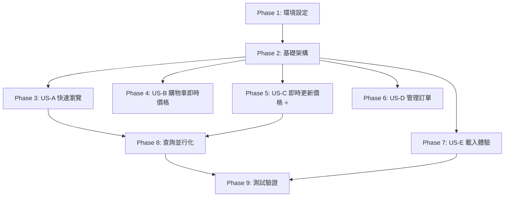

# 實作任務清單：效能優化專案

**功能編號**：018
**功能名稱**：performance-optimization
**規格文件**：[spec.md](spec.md)
**實作計畫**：[plan.md](plan.md)
**快速入門**：[quickstart.md](quickstart.md)
**建立日期**：2026-01-17

---

## 任務概覽

| Phase | 描述 | 任務數 | 預估時間 | 狀態 |
|-------|-----|-------|---------|------|
| Phase 1 | 環境設定與準備 | 2 | 30分鐘 | Pending |
| Phase 2 | 基礎架構（阻塞性前置任務） | 3 | 1小時 | Pending |
| Phase 3 | US-A: 快速瀏覽商品目錄 | 7 | 2.5小時 | Pending |
| Phase 4 | US-B: 購物車即時價格計算 | 2 | 30分鐘 | Pending |
| Phase 5 | US-C: 即時更新商品價格（修復空白Bug） | 4 | 2小時 | Pending |
| Phase 6 | US-D: 管理訂單狀態 | 1 | 15分鐘 | Pending |
| Phase 7 | US-E: 優雅的載入體驗 | 7 | 2小時 | Pending |
| Phase 8 | 查詢並行化優化 | 3 | 2小時 | Pending |
| Phase 9 | 測試與驗證 | 5 | 2小時 | Pending |
| **總計** | **9 個 Phase** | **34** | **12.5小時** | **0% 完成** |

---

## 使用者故事對應

本專案任務依照以下使用者場景組織：

- **US-A**：場景 A - 快速瀏覽商品目錄（前台客戶）
- **US-B**：場景 B - 購物車即時價格計算（前台客戶）
- **US-C**：場景 C - 即時更新商品價格（後台管理員）⭐ **最高優先級**
- **US-D**：場景 D - 管理訂單狀態（後台管理員）
- **US-E**：場景 E - 優雅的載入體驗（所有使用者）

---

## Phase 1：環境設定與準備

**目標**：確保開發環境正確設定，並了解專案結構

### 任務清單

- [X] T001 確認 Next.js 15.1+ 與 Supabase SDK 版本符合需求
- [X] T002 檢查專案結構，確認所有需要修改的檔案存在

**驗收標準**：
- Next.js 版本 >= 15.1
- @supabase/supabase-js >= 2.47
- 所有路由檔案可正常訪問

---

## Phase 2：基礎架構（阻塞性前置任務）

**目標**：建立共用的基礎元件與工具函數，供所有使用者故事使用

**獨立測試標準**：
- [ ] Skeleton 元件正確渲染
- [ ] 樣式符合 Neo-Brutalism 設計規範
- [ ] import 路徑正確無誤

### 任務清單

- [X] T003 [P] 確認或建立基礎骨架屏元件 `components/ui/skeleton.tsx`
- [X] T004 [P] 建立複合骨架屏元件 `components/shop/product-card-skeleton.tsx`
- [X] T005 [P] 確認 Next.js cache helpers 正確 import（revalidateTag、revalidatePath）

**驗收標準**：
- `Skeleton` 元件包含 `border-2 border-black` 樣式
- `ProductCardSkeleton` 和 `ProductGridSkeleton` 可正常使用
- 所有 import 無錯誤

---

## Phase 3：US-A - 快速瀏覽商品目錄

**使用者故事**：場景 A - 快速瀏覽商品目錄

**角色**：已登入的批發客戶
**目標**：快速瀏覽商品並查看價格

**獨立測試標準**：
- [ ] 商品列表頁載入時間 < 1.5 秒
- [ ] 商品詳情頁載入時間 < 1 秒
- [ ] Response Headers 包含 `Cache-Control: s-maxage=N`
- [ ] 第 2 次訪問明顯更快（快取生效）
- [ ] 價格顯示正確（符合客戶等級）

### 任務清單

#### 前台快取策略設定

- [X] T006 [US-A] 移除前台 Layout 的 force-dynamic，新增 ISR 快取 `app/(shop)/layout.tsx`
- [X] T007 [P] [US-A] 設定首頁快取時間（revalidate: 300）`app/(shop)/store/home/page.tsx`
- [X] T008 [P] [US-A] 設定商品列表頁快取時間（revalidate: 300）`app/(shop)/store/products/page.tsx`
- [X] T009 [P] [US-A] 設定商品詳情頁快取時間（revalidate: 600）`app/(shop)/store/[id]/page.tsx`
- [X] T010 [P] [US-A] 設定系列頁面快取時間（revalidate: 300）`app/(shop)/store/series/[id]/page.tsx`

#### 快取失效機制（商品相關）

- [X] T011 [US-A] 新增商品 Server Actions 快取失效邏輯（createProduct、updateProduct、deleteProduct）`lib/actions/products.ts`
- [X] T012 [US-A] 新增系列與分類 Server Actions 快取失效邏輯 `lib/actions/series.ts` 和 `lib/actions/categories.ts`（可選）

**Phase 3 驗收場景**（場景 A）：
1. 客戶開啟商品列表頁面 `/store/products`
2. 系統在 1.5 秒內顯示商品列表
3. 客戶點擊商品進入詳情頁
4. 系統在 1 秒內顯示商品詳情
5. 客戶看到符合其會員等級的價格

**預期結果**：
- ✅ 頁面載入時間比當前快 50% 以上
- ✅ 價格顯示正確
- ✅ 無白屏或長時間等待

---

## Phase 4：US-B - 購物車即時價格計算

**使用者故事**：場景 B - 購物車即時價格計算

**角色**：已登入的批發客戶
**目標**：將商品加入購物車並確認價格

**獨立測試標準**：
- [ ] 購物車頁面無快取（force-dynamic）
- [ ] 訂單頁面無快取（force-dynamic）
- [ ] 購物車顯示即時價格（無延遲）
- [ ] 價格更新後，購物車立即反映新價格

### 任務清單

- [X] T013 [P] [US-B] 確保購物車頁保持動態渲染 `app/(shop)/store/cart/page.tsx`（已是 Client Component）
- [X] T014 [P] [US-B] 確保訂單頁保持動態渲染 `app/(shop)/store/orders/page.tsx`（已是 Client Component）

**Phase 4 驗收場景**（場景 B）：
1. 客戶在商品頁點擊「加入購物車」
2. 客戶前往購物車頁面 `/store/cart`
3. 系統即時查詢最新價格（不使用快取）
4. 顯示當前正確的小計與總計

**預期結果**：
- ✅ 購物車中的價格永遠是最新的
- ✅ 即使管理員剛更新價格，客戶也能看到新價格
- ✅ 結帳金額準確無誤

---

## Phase 5：US-C - 即時更新商品價格（修復空白Bug）⭐

**使用者故事**：場景 C - 即時更新商品價格

**角色**：後台管理員
**目標**：更新某商品的等級價格並立即生效

**獨立測試標準**：
- [ ] 價格更新後，頁面**立即**顯示新價格（無空白）
- [ ] **無需手動刷新瀏覽器**
- [ ] 前台客戶在下次查詢時看到新價格（快取失效機制生效）
- [ ] 多個管理員同時操作時，看到的資料一致

### 任務清單

#### 後台動態渲染確保

- [X] T015 [US-C] 確認後台 Layout 的 force-dynamic 存在 `app/(admin)/admin/layout.tsx`
- [X] T016 [US-C] 檢查所有後台頁面的 dynamic 設定（dashboard、tier-prices、products、orders、users）

#### 快取失效機制（價格相關）⭐ **最關鍵**

- [X] T017 [US-C] 新增價格 Server Actions 快取失效邏輯（setTierPrice、batchSetTierPrices）`lib/actions/tier-prices.ts`（**修復空白Bug的關鍵** ✅）
- [X] T018 [US-C] 新增訂單 Server Actions 快取失效邏輯（updateOrderStatus）`lib/actions/orders.ts`（可選）

**Phase 5 驗收場景**（場景 C）⭐：
1. 管理員登入後台 `/admin`
2. 前往價格管理頁面 `/admin/tier-prices`
3. 選擇系列和等級，設定新價格 $100
4. 點擊「儲存」按鈕
5. 系統更新價格並顯示成功訊息
6. **關鍵驗證**：頁面立即顯示更新後的價格清單

**預期結果**（**修復空白Bug的驗收**）：
- ✅ 價格更新後，管理員立即在同一頁面看到新價格
- ✅ **無空白頁面問題**
- ✅ **無需手動刷新瀏覽器**
- ✅ 前台客戶在下次查詢時看到新價格

---

## Phase 6：US-D - 管理訂單狀態

**使用者故事**：場景 D - 管理訂單狀態

**角色**：後台管理員
**目標**：檢視最新訂單並更新狀態

**獨立測試標準**：
- [ ] 訂單資料永遠是最新的
- [ ] 多個管理員同時操作時不會看到過時資料
- [ ] 狀態更新立即生效，無需刷新

### 任務清單

- [X] T019 [US-D] 確認訂單相關頁面的快取失效邏輯已完整（已在 T018 完成，此為驗證任務）

**Phase 6 驗收場景**（場景 D）：
1. 管理員前往訂單列表頁 `/admin/orders`
2. 系統顯示最新的訂單清單（即時查詢，無快取）
3. 管理員點擊訂單詳情
4. 系統顯示最新的訂單資訊（即時查詢）
5. 管理員更新訂單狀態為「已出貨」
6. 頁面立即反映新狀態

**預期結果**：
- ✅ 訂單資料永遠是最新的
- ✅ 多個管理員同時操作時不會看到過時資料
- ✅ 狀態更新立即生效，無需刷新

---

## Phase 7：US-E - 優雅的載入體驗

**使用者故事**：場景 E - 優雅的載入體驗

**角色**：任何使用者
**目標**：在頁面載入期間看到友善的載入提示

**獨立測試標準**：
- [ ] 骨架屏立即顯示（< 100ms）
- [ ] 無白屏閃爍
- [ ] 載入狀態視覺上符合 Neo-Brutalism 風格
- [ ] 骨架屏佈局與實際內容一致

### 任務清單

#### Loading UI 實作

- [X] T020 [P] [US-E] 實作系列詳情頁 Loading UI `app/(shop)/store/series/[id]/loading.tsx`（新建）
- [X] T021 [P] [US-E] 實作客戶訂單列表 Loading UI `app/(shop)/store/orders/loading.tsx`（新建）
- [X] T022 [P] [US-E] 實作管理員訂單列表 Loading UI `app/(admin)/admin/orders/loading.tsx`（新建）
- [X] T023 [P] [US-E] 實作價格管理頁面 Loading UI `app/(admin)/admin/tier-prices/loading.tsx`（新建）
- [X] T024 [P] [US-E] 實作商品管理頁面 Loading UI `app/(admin)/admin/products/loading.tsx`（新建）
- [X] T025 [P] [US-E] 確認商品列表頁 Loading UI 存在 `app/(shop)/store/products/loading.tsx`
- [X] T026 [P] [US-E] 確認購物車頁 Loading UI 存在 `app/(shop)/store/cart/loading.tsx`

**Phase 7 驗收場景**（場景 E）：
1. 使用者點擊連結前往新頁面
2. 系統立即顯示 Neo-Brutalism 風格的骨架屏
3. 資料載入完成後，內容平滑替換骨架屏

**預期結果**：
- ✅ 無白屏閃爍
- ✅ 載入狀態視覺上符合品牌風格（Neo-Brutalism）
- ✅ 使用者能感知到系統正在運作

---

## Phase 8：查詢並行化優化

**目標**：將序列執行的獨立查詢改為並行執行，減少 waterfall 請求

**獨立測試標準**：
- [ ] Dashboard 載入時間減少 50% 以上
- [ ] 商品頁面載入時間減少 60% 以上（600ms → 200ms）
- [ ] 多個查詢的開始時間相近（< 50ms 差異）
- [ ] 資料正確性不變

### 任務清單

- [X] T027 優化 Dashboard 查詢（9 個序列 → 7 個並行）`lib/actions/dashboard.ts`
- [X] T028 [P] 優化商品頁面查詢（3 個序列 → 並行）`app/(shop)/store/products/page.tsx`
- [X] T029 [P] 檢查其他頁面的序列查詢並優化 `app/(shop)/store/series/[id]/page.tsx` 等

**Phase 8 驗收標準**：
- ✅ Dashboard 查詢時間 < 300ms（當前約 600ms）
- ✅ 商品頁面查詢時間 < 200ms（當前約 600ms）
- ✅ 使用瀏覽器開發者工具確認查詢並行執行

---

## Phase 9：測試與驗證

**目標**：驗證所有使用者故事的完整性與效能指標

### 任務清單

- [ ] T030 前台快取驗證測試（US-A）
- [ ] T031 後台即時性驗證測試（US-C）⭐ **修復空白Bug驗證**
- [ ] T032 Loading UI 驗證測試（US-E）
- [ ] T033 查詢並行化驗證測試（Phase 8）
- [ ] T034 效能指標測試（Lighthouse、Vercel Analytics）

**Phase 9 測試場景**：

### T030：前台快取驗證（US-A）

**測試步驟**：
1. 訪問商品列表頁 `http://localhost:3000/store/products`
2. 記錄載入時間
3. 刷新頁面
4. 確認第 2 次明顯更快

**驗收標準**：
- [ ] 第 1 次：約 1.5-2 秒
- [ ] 第 2 次：< 0.5 秒（快取命中）
- [ ] Response Headers 包含 `Cache-Control: s-maxage=300`

---

### T031：後台即時性驗證（US-C）⭐ **最關鍵測試**

**測試步驟**（場景 C 完整複現）：
1. 啟動開發伺服器 `pnpm dev`
2. 管理員登入後台 `/admin`
3. 前往價格管理頁面 `/admin/tier-prices`
4. 選擇系列與等級，設定新價格 $100
5. 點擊「儲存」
6. **關鍵驗證**：觀察頁面是否立即顯示新價格

**驗收標準**：
- [ ] 儲存成功後，頁面**立即**顯示新價格 $100
- [ ] **無空白頁面**
- [ ] **無需手動刷新瀏覽器**
- [ ] 前台客戶在 5 分鐘內看到新價格

**如果失敗**：
- 檢查 `lib/actions/tier-prices.ts` 中有 `revalidatePath('/admin/tier-prices')`
- 確認函數執行成功（無錯誤）
- 檢查瀏覽器 Console 是否有錯誤

---

### T032：Loading UI 驗證（US-E）

**測試步驟**：
1. 開啟開發者工具 > Network 面板
2. 設定網路節流（Slow 3G）
3. 訪問各個頁面

**檢查頁面**：
- `/store/series/123`
- `/store/orders`
- `/admin/orders`
- `/admin/tier-prices`
- `/admin/products`

**驗收標準**：
- [ ] 骨架屏立即顯示（無白屏）
- [ ] 佈局與實際內容相似
- [ ] 樣式符合 Neo-Brutalism

---

### T033：查詢並行化驗證（Phase 8）

**測試步驟**：
1. 開啟瀏覽器開發者工具 > Network 面板
2. 訪問 Dashboard `/admin/dashboard`
3. 查看 Waterfall 視圖

**驗收標準**：
- [ ] 多個 Supabase 查詢的開始時間相近（< 50ms 差異）
- [ ] 總查詢時間 < 300ms
- [ ] Dashboard 完整載入時間 < 1 秒

---

### T034：效能指標測試

**使用工具**：
- Chrome DevTools Lighthouse
- Vercel Analytics（部署後）

**測試頁面**：
- `/store/products`
- `/store/123`
- `/admin/dashboard`

**驗收標準**：
- [ ] **FCP**：< 1.2 秒（當前約 2.8 秒，改善 57%）
- [ ] **LCP**：< 2 秒（當前約 3.5 秒，改善 43%）
- [ ] **TTI**：< 2.5 秒
- [ ] **CLS**：< 0.1

---

## 相依性關係圖

**關鍵路徑**：
1. Phase 1 → Phase 2 → **Phase 5（US-C）** → Phase 9（T031）

**並行機會**：
- Phase 3、4、5、6、7 可在 Phase 2 完成後並行開始
- Phase 7 的 7 個任務（T020-T026）完全獨立，可並行執行

---

## 實作策略

### MVP 範圍（最小可行產品）

**建議先完成 Phase 5（US-C）**，因為：
1. ⭐ 修復當前最嚴重的 Bug（價格管理頁面空白）
2. 直接影響管理員的核心工作流程
3. 實作時間最短（約 2 小時）
4. 可立即驗證效果

**MVP 任務清單**：
- T001-T002（環境設定）
- T015-T018（US-C 相關任務）
- T031（驗證空白 Bug 已修復）

**預估時間**：2.5 小時

---

### 增量交付順序

1. **第一波**（修復關鍵 Bug）：
   - Phase 1、2、5（US-C）
   - 預估：3 小時
   - 交付：修復價格管理頁面空白 Bug

2. **第二波**（前台效能提升）：
   - Phase 3（US-A）、Phase 8（查詢並行化）
   - 預估：4.5 小時
   - 交付：前台載入速度提升 50%+

3. **第三波**（使用者體驗提升）：
   - Phase 4（US-B）、Phase 7（US-E）
   - 預估：2.5 小時
   - 交付：購物車即時價格 + Loading UI

4. **第四波**（完整驗證）：
   - Phase 6（US-D）、Phase 9（測試）
   - 預估：2.5 小時
   - 交付：完整效能驗證報告

---

## 並行執行建議

### 高並行度任務組

**組 1：Loading UI 實作**（可 7 人並行）
- T020、T021、T022、T023、T024、T025、T026

**組 2：頁面快取設定**（可 4 人並行）
- T007、T008、T009、T010

**組 3：快取失效機制**（可 2 人並行）
- T011、T012

---

## 風險與注意事項

### 高風險任務

| 任務 | 風險描述 | 緩解措施 |
|------|---------|---------|
| T017 | 如果未正確實作，空白 Bug 不會修復 | 仔細測試場景 C，確保有 `revalidatePath('/admin/tier-prices')` |
| T027 | 並行查詢可能導致資料不一致 | 逐一驗證查詢之間無相依性 |
| T006 | 移除 force-dynamic 可能影響認證流程 | 確保認證邏輯使用 `checkAuth()`（已有 React cache） |

---

## 快速參考

### 快取策略矩陣

| 頁面路由 | 快取策略 | Revalidate | 任務 |
|---------|---------|-----------|------|
| `/store/home` | ISR | 300s | T007 |
| `/store/products` | ISR | 300s | T008 |
| `/store/[id]` | ISR | 600s | T009 |
| `/store/series/[id]` | ISR | 300s | T010 |
| `/store/cart` | force-dynamic | N/A | T013 |
| `/admin/*` | force-dynamic | N/A | T015-T016 |

### Server Actions 快取失效檢查

| Server Action | 快取失效邏輯 | 任務 |
|--------------|-------------|------|
| `createProduct()` | `revalidateTag('products')` | T011 |
| `updateProduct()` | `revalidateTag('products')` + `revalidatePath('/store/[id]')` | T011 |
| `updateTierPrice()` | `revalidatePath('/admin/tier-prices')` + `revalidateTag('tier-prices')` | **T017 ⭐** |
| `updateOrderStatus()` | `revalidateTag('orders')` + `revalidatePath('/admin/orders')` | T018 |

---

## 完成檢查清單

### 使用者故事完成度

- [ ] **US-A**：快速瀏覽商品目錄（7 個任務）
- [ ] **US-B**：購物車即時價格計算（2 個任務）
- [ ] **US-C**：即時更新商品價格（4 個任務）⭐
- [ ] **US-D**：管理訂單狀態（1 個任務）
- [ ] **US-E**：優雅的載入體驗（7 個任務）

### 效能指標達成

- [ ] 前台 FCP < 1.2 秒
- [ ] 前台 LCP < 2 秒
- [ ] 商品列表載入 < 1.5 秒
- [ ] Dashboard 查詢 < 300ms
- [ ] 伺服器負荷減少 40-50%

### 正確性指標達成

- [ ] 後台資料 100% 即時
- [ ] 前台價格 100% 正確
- [ ] **零空白頁面問題** ⭐

### 使用者體驗指標達成

- [ ] Loading 狀態覆蓋率 100%
- [ ] 骨架屏顯示時間 < 100ms
- [ ] CLS < 0.1

---

**任務清單撰寫者**：Claude Sonnet 4.5
**最後更新**：2026-01-17
**格式驗證**：✅ 所有任務符合 checklist 格式（checkbox + ID + 標籤 + 檔案路徑）
