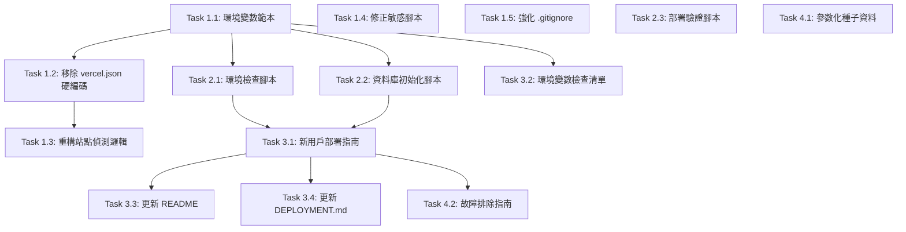

# Implementation Plan: 專案可移植性修復

**Feature**: 019-portability-fixes
**Status**: Planning
**Created**: 2026-01-22
**Last Updated**: 2026-01-22

---

## Executive Summary

本實施計畫旨在將 Vsale-lite 從單一環境硬編碼系統轉變為完全可移植的開源專案。透過移除硬編碼、建立環境變數範本、提供自動化工具和完善文檔，確保任何開發者都能在 2 小時內完成部署。

**關鍵目標**:
- ✅ 移除所有硬編碼的 Supabase 專案 ID
- ✅ 建立完整的環境變數範本系統
- ✅ 提供 3 個自動化工具（環境檢查、資料庫初始化、部署驗證）
- ✅ 撰寫新用戶部署指南（目標 2 小時內完成）
- ✅ 確保向後相容性（不破壞現有功能）

**預估時間**: 11.5 小時（分 4 個階段執行）

---

## Technical Context

### 當前架構

#### 環境管理
- **環境變數**: 使用 `.env.local` 儲存配置
- **Vercel 部署**: 透過 Vercel Dashboard 設定環境變數
- **Supabase 整合**: 使用 `NEXT_PUBLIC_SUPABASE_URL` 和金鑰

#### 專案結構
```
vsale/
├── app/                      # Next.js App Router
│   ├── api/                  # API Routes
│   │   ├── env-test/         # 環境變數測試端點
│   │   └── check-connection/ # 連線檢查端點
├── lib/                      # 共用函式庫
│   ├── supabase/             # Supabase 客戶端
│   └── actions/              # Server Actions
├── scripts/                  # 工具腳本（備份、健康檢查）
└── docs/                     # 文檔目錄
```

#### 硬編碼問題分布
| 檔案 | 硬編碼內容 | 影響 |
|------|-----------|------|
| `vercel.json` | Supabase URL + ANON_KEY | 🔴 阻斷新用戶部署 |
| `app/api/env-test/route.ts` | 專案 ID 檢測邏輯 | 🔴 功能限制 |
| `app/api/check-connection/route.ts` | 專案 ID 檢查 | 🔴 功能限制 |
| `import-data.ps1` | 資料庫密碼 | 🔴 安全風險 |
| `restore-backup.js` | 專案 ID 引用 | 🟡 影響可用性 |
| `DEPLOYMENT.md` | 專案特定資訊 | 🟡 文檔不適用 |

### 技術棧

**核心技術**:
- **Runtime**: Node.js v22.x
- **Framework**: Next.js 15.1+ (App Router)
- **Database**: Supabase (PostgreSQL)
- **Deployment**: Vercel (Serverless)
- **Package Manager**: pnpm 9.x

**工具腳本技術選擇**:
- **JavaScript (Node.js)**: 環境檢查、資料庫初始化、部署驗證
  - 理由: 專案已使用 Node.js，無需額外依賴
  - 可使用專案現有套件（@supabase/supabase-js, dotenv）
- **Markdown**: 文檔撰寫
  - 理由: 易於版本控制，GitHub 原生支援

### 依賴項

#### 現有套件（不需新增）
- `@supabase/supabase-js`: 用於資料庫初始化腳本
- `dotenv`: 用於環境變數載入
- `readline`: Node.js 內建，用於互動式輸入
- `https`: Node.js 內建，用於 HTTP 請求

#### 無需新增依賴
所有功能使用現有工具鏈實現，無新增套件需求。

### 整合點

#### 1. 環境變數系統
**整合方式**:
- 本機開發: `.env.local` → Next.js 自動載入
- Vercel 部署: Vercel Dashboard → 環境變數設定

**驗證點**:
- `process.env.NEXT_PUBLIC_SUPABASE_URL` 在所有環境可用
- 環境檢查腳本可正確讀取 `.env.local`

#### 2. Supabase CLI 整合
**整合方式**:
- Migration: `supabase db push` 執行 SQL 檔案
- 初始化: 使用 Supabase Admin API 建立使用者

**驗證點**:
- `pnpm init-db` 可成功建立管理員帳號
- 帳號可登入後台

#### 3. Vercel 部署流程
**整合方式**:
- GitHub Actions: 推送 → 自動部署
- 環境變數: 透過 Vercel Dashboard 設定

**驗證點**:
- 部署後 `/api/env-test` 顯示正確環境變數
- 部署驗證腳本所有測試通過

### 風險評估

#### 高風險項目

**1. 現有部署破壞**
- **風險**: 修改 `vercel.json` 可能影響現有部署
- **緩解措施**:
  - 在測試分支先驗證
  - 使用 Vercel Preview 環境測試
  - 保留 Git 回滾能力

**2. 環境變數遺漏**
- **風險**: 新用戶可能遺漏必要環境變數導致啟動失敗
- **緩解措施**:
  - 提供完整的 `.env.local.example`
  - 環境檢查腳本自動驗證
  - 文檔包含清晰的設定步驟

**3. Migration 相容性**
- **風險**: 修改可能影響資料庫 Migration 流程
- **緩解措施**:
  - 不修改任何 Migration 檔案
  - 僅修改種子資料（seed.sql）的執行邏輯
  - 確保冪等性

#### 中風險項目

**4. 文檔過時**
- **風險**: 多個文檔可能產生不一致資訊
- **緩解措施**:
  - 建立單一主要部署指南
  - 標記舊文檔為「過時」
  - 定期審查文檔

**5. 腳本跨平台相容性**
- **風險**: PowerShell 腳本在非 Windows 平台無法執行
- **緩解措施**:
  - 主要工具使用 JavaScript（跨平台）
  - PowerShell 腳本僅用於特定場景（已標註）

### 未解決的問題

目前無未解決的技術問題。所有需求已明確，實施路徑清晰。

---

## Constitution Check

### 憲章原則檢查

#### I. 使用者角色優先 ✅
**影響**: 無
**理由**: 本功能不涉及前後台使用者介面修改，僅處理部署配置與工具腳本。

#### II. 等級綁定價格 ✅
**影響**: 無
**理由**: 不修改任何業務邏輯或資料模型。

#### III. 使用者故事驅動開發 ✅
**影響**: 符合
**檢查**:
- ✅ 規格包含 3 個明確的使用場景
- ✅ 每個場景可獨立測試
- ✅ 功能需求按 P0/P1 優先級分類

#### IV. API 模組化與職責分離 ✅
**影響**: 無
**理由**: 不新增或修改 API 端點功能，僅重構站點檢測邏輯（移除硬編碼）。

**修改的 API 端點**:
- `app/api/env-test/route.ts`: 移除硬編碼檢測邏輯 → 改為動態提取
- `app/api/check-connection/route.ts`: 移除硬編碼檢查 → 改為通用邏輯

**職責不變**: API 端點仍負責環境檢查與連線測試，僅實作方式調整。

#### V. 設計系統一致性 ✅
**影響**: 無
**理由**: 不涉及 UI 元件或樣式修改。

#### VI. 負庫存支援 ✅
**影響**: 無
**理由**: 不修改庫存相關邏輯。

#### VII. 響應式設計規範 ✅
**影響**: 無
**理由**: 不涉及前端介面修改。

#### VIII. 統一對話框系統 ✅
**影響**: 符合
**檢查**:
- ✅ 新增的 JavaScript 工具腳本在 CLI 環境執行，不使用瀏覽器對話框
- ✅ 不修改任何前端程式碼

### 向後相容性檢查 ✅

**核心約束**: 不破壞現有功能

**檢查清單**:
- ✅ 不修改資料庫結構或 Migration 檔案
- ✅ 不修改任何業務邏輯（訂單、商品、使用者管理）
- ✅ 不修改前後台 UI 元件
- ✅ API 端點功能保持不變（僅移除硬編碼）
- ✅ 現有環境變數名稱保持不變
- ✅ 現有部署環境可繼續使用（環境變數已在 Vercel Dashboard 設定）

**測試策略**:
- 本機測試: 執行 `pnpm dev` 確認所有頁面正常
- E2E 測試: 登入前後台，執行關鍵功能（瀏覽商品、建立訂單）
- Vercel Preview: 在測試環境驗證部署

### 憲章合規結論

**評估結果**: ✅ 完全符合

所有憲章原則都已檢查，本功能：
- 不違反任何憲章原則
- 不修改任何業務邏輯或 UI
- 專注於部署配置與工具腳本
- 確保向後相容性

**可以進入實施階段**。

---

## Implementation Phases

### Phase 0: 準備與研究 ✅

**狀態**: 已完成（在規格建立階段）

**完成項目**:
- ✅ 探索專案硬編碼問題（3 個並行 agents）
- ✅ 分析環境變數使用情況
- ✅ 識別敏感信息洩露風險
- ✅ 研究部署流程與 CI/CD 配置
- ✅ 建立詳細實施計畫

**成果**:
- [計畫文件](../../.claude/plans/valiant-sauteeing-raccoon.md)
- [探索報告](已整合於計畫中)

---

### Phase 1: P0 問題修復（核心阻斷性問題）

**目標**: 移除所有硬編碼值，建立環境變數範本系統

**預估時間**: 2.5 小時

#### Task 1.1: 建立環境變數範本
**優先級**: P0
**預估時間**: 30 分鐘

**步驟**:
1. 建立 `.env.local.example` 檔案
2. 包含所有必要變數（3 個）:
   - `NEXT_PUBLIC_SUPABASE_URL`
   - `NEXT_PUBLIC_SUPABASE_ANON_KEY`
   - `SUPABASE_SERVICE_ROLE_KEY`
3. 包含所有可選變數（8 個）:
   - DB 直連設定（4 個）
   - GCS 備份設定（4 個）
   - 站點二設定（2 個）
4. 每個變數新增詳細註解說明取得方式
5. 使用繁體中文撰寫註解

**驗收標準**:
- [ ] 檔案存在於專案根目錄
- [ ] 包含所有 11 個變數
- [ ] 每個變數都有取得方式說明
- [ ] 格式正確，可直接複製使用

**依賴**: 無

---

#### Task 1.2: 移除 vercel.json 硬編碼
**優先級**: P0
**預估時間**: 15 分鐘

**步驟**:
1. 編輯 `vercel.json`
2. 移除 `env` 區塊（第 7-10 行）
3. 保留其他配置（buildCommand, framework, regions, crons）
4. 測試本機建置: `pnpm build`
5. 提交變更

**驗收標準**:
- [ ] `vercel.json` 無 `env` 區塊
- [ ] 保留所有其他配置
- [ ] 本機建置成功

**依賴**: Task 1.1（確保有範本檔案可參考）

---

#### Task 1.3: 重構站點偵測邏輯
**優先級**: P0
**預估時間**: 45 分鐘

**步驟**:
1. 修改 `app/api/env-test/route.ts`:
   - 移除硬編碼的 `isMainSite` 和 `isSite2` 檢查
   - 改為動態提取 `projectRef`
   - 檢查是否配置主站點和站點二環境變數

2. 修改 `app/api/check-connection/route.ts`:
   - 移除硬編碼的專案 ID 檢查
   - 改為通用的專案 ID 提取

3. 本機測試:
   - 執行 `pnpm dev`
   - 訪問 `http://localhost:3000/api/env-test`
   - 驗證輸出包含 `projectRef` 而非硬編碼檢查

4. 提交變更

**驗收標準**:
- [ ] `env-test` API 顯示動態 `projectRef`
- [ ] `check-connection` API 無硬編碼檢查
- [ ] 本機測試通過
- [ ] 執行 `git grep "qwovavytryvgchcowjof"` 僅在文檔中出現

**依賴**: Task 1.2（環境變數配置正確）

---

#### Task 1.4: 修正敏感腳本
**優先級**: P0
**預估時間**: 30 分鐘

**步驟**:
1. 修改 `import-data.ps1`:
   ```powershell
   # 移除: $DB_PASSWORD = "Devape-BM69"
   # 新增:
   $DB_PASSWORD = $env:DB_PASSWORD_SITE2
   if (-not $DB_PASSWORD) {
       Write-Host "❌ 錯誤：請設定環境變數 DB_PASSWORD_SITE2"
       exit 1
   }
   ```

2. 修改 `restore-backup.js`:
   - 移除硬編碼的專案 ID (`qwovavytryvgchcowjof`)
   - 改為動態提取: `const projectRef = supabaseUrl?.split('.')[0]?.split('//')[1]`

3. 測試腳本（如果可行）

4. 提交變更

**驗收標準**:
- [ ] `import-data.ps1` 從環境變數讀取密碼
- [ ] `restore-backup.js` 無硬編碼專案 ID
- [ ] 執行 `git grep "Devape-BM69"` 無結果
- [ ] 執行 `git grep "4Og37Vy1GzQJFq6K"` 無結果（資料庫密碼）

**依賴**: 無

---

#### Task 1.5: 強化 .gitignore
**優先級**: P0
**預估時間**: 15 分鐘

**步驟**:
1. 檢查現有 `.gitignore` 規則
2. 確認以下規則存在:
   - `.env*.local`
   - `.env`
   - `.env.vercel`
   - `service-account-key.json`
   - `*-service-account-key.json`

3. 如有遺漏，新增規則
4. 執行 `git status --ignored` 驗證敏感檔案被排除
5. 提交變更

**驗收標準**:
- [ ] `.gitignore` 包含所有敏感檔案規則
- [ ] `.env.local` 不在 Git 追蹤中
- [ ] `.env.vercel` 不在 Git 追蹤中

**依賴**: 無

---

### Phase 2: 自動化工具建立

**目標**: 提供環境檢查、資料庫初始化、部署驗證工具

**預估時間**: 3.5 小時

#### Task 2.1: 環境檢查腳本
**優先級**: P0
**預估時間**: 1 小時

**步驟**:
1. 建立 `scripts/check-environment.js`
2. 實作功能:
   - 載入 `.env.local` 使用 `dotenv`
   - 檢查 3 個必要環境變數
   - 檢查 8 個可選環境變數
   - 驗證 Supabase URL 格式（Regex: `^https://[a-z]{20}\.supabase\.co$`）
   - 提供清晰的成功/失敗訊息（繁體中文）

3. 在 `package.json` 新增指令:
   ```json
   "check-env": "node scripts/check-environment.js"
   ```

4. 測試:
   - 刪除 `.env.local` → 應顯示錯誤
   - 建立不完整的 `.env.local` → 應列出缺少變數
   - 建立完整的 `.env.local` → 應顯示成功

5. 提交變更

**驗收標準**:
- [ ] 腳本檔案存在
- [ ] `pnpm check-env` 可執行
- [ ] 缺少變數時顯示 ❌ 和變數名稱
- [ ] 所有檢查通過時顯示 ✅
- [ ] 輸出使用繁體中文

**依賴**: Task 1.1（環境變數範本）

---

#### Task 2.2: 資料庫初始化腳本
**優先級**: P0
**預估時間**: 1.5 小時

**步驟**:
1. 建立 `scripts/init-database.js`
2. 實作功能:
   - 使用 `readline` 模組進行互動式輸入
   - 提示輸入管理員 Email
   - 提示輸入密碼（最少 8 字元）
   - 提示輸入顯示名稱（可選，預設「系統管理員」）
   - 使用 Supabase Admin API 建立使用者:
     ```javascript
     const { data, error } = await supabase.auth.admin.createUser({
       email,
       password,
       email_confirm: true
     })
     ```
   - 插入到 `profiles` 表（role = 'admin'）
   - 顯示登入資訊

3. 在 `package.json` 新增指令:
   ```json
   "init-db": "node scripts/init-database.js"
   ```

4. 測試:
   - 執行 `pnpm init-db`
   - 輸入管理員資訊
   - 驗證可登入後台

5. 提交變更

**驗收標準**:
- [ ] 腳本檔案存在
- [ ] `pnpm init-db` 可執行
- [ ] 提示輸入 Email、密碼、名稱
- [ ] 成功建立管理員帳號
- [ ] 可使用建立的帳號登入後台
- [ ] 重複執行不會建立重複帳號
- [ ] 輸出使用繁體中文

**依賴**: Task 1.1（環境變數配置）

---

#### Task 2.3: 部署驗證腳本
**優先級**: P1
**預估時間**: 1 小時

**步驟**:
1. 建立 `scripts/verify-deployment.js`
2. 實作功能:
   - 接受部署 URL 作為參數
   - 測試 4 個端點:
     - `/login` (前台登入)
     - `/admin/login` (後台登入)
     - `/api/env-test` (環境變數)
     - `/api/check-connection` (資料庫連線)
   - 使用 Node.js `https` 模組發送請求
   - 驗證回應狀態碼和內容
   - 顯示測試總結（通過/失敗數量）

3. 在 `package.json` 新增指令:
   ```json
   "verify-deploy": "node scripts/verify-deployment.js"
   ```

4. 測試:
   - 對測試環境執行 `pnpm verify-deploy https://test.vercel.app`
   - 驗證報告正確

5. 提交變更

**驗收標準**:
- [ ] 腳本檔案存在
- [ ] `pnpm verify-deploy <URL>` 可執行
- [ ] 測試 4 個端點
- [ ] 顯示通過/失敗報告
- [ ] 失敗時提供除錯提示
- [ ] 輸出使用繁體中文

**依賴**: 無（可獨立執行）

---

### Phase 3: 文檔更新

**目標**: 建立通用的部署指南與檢查清單

**預估時間**: 4 小時

#### Task 3.1: 新用戶部署指南
**優先級**: P0
**預估時間**: 2 小時

**步驟**:
1. 建立 `docs/NEW_DEPLOYMENT_GUIDE.md`
2. 撰寫 8 個步驟:
   - 步驟 1: Fork 專案
   - 步驟 2: 建立 Supabase 專案
   - 步驟 3: 環境變數設定
   - 步驟 4: 初始化資料庫
   - 步驟 5: 本機測試
   - 步驟 6: 部署到 Vercel
   - 步驟 7: 驗證線上環境
   - 步驟 8: 設定 GitHub Actions（可選）

3. 每步驟包含:
   - 預估時間
   - 詳細指令
   - 成功標準
   - 常見問題

4. 新增常見問題章節（至少 4 個問題）

5. 審查與校對

6. 提交變更

**驗收標準**:
- [ ] 文檔檔案存在
- [ ] 包含完整的 8 個步驟
- [ ] 每步驟有預估時間
- [ ] 包含常見問題章節
- [ ] 使用繁體中文撰寫
- [ ] 總預估時間 < 2 小時

**依賴**: Task 2.1, 2.2（需引用腳本指令）

---

#### Task 3.2: 環境變數檢查清單
**優先級**: P1
**預估時間**: 30 分鐘

**步驟**:
1. 建立 `docs/ENV_VARIABLES_CHECKLIST.md`
2. 列出所有環境變數:
   - 必填變數（3 個）
   - 可選變數（8 個）
3. 每個變數包含:
   - 變數名稱
   - 用途說明
   - 取得方式
   - 驗證指令
4. 新增環境差異對照表（本機 vs Vercel）
5. 提交變更

**驗收標準**:
- [ ] 文檔檔案存在
- [ ] 列出所有 11 個變數
- [ ] 每個變數都有取得方式
- [ ] 包含驗證指令
- [ ] 使用繁體中文撰寫

**依賴**: Task 1.1（環境變數範本）

---

#### Task 3.3: 更新 README.md
**優先級**: P0
**預估時間**: 1 小時

**步驟**:
1. 編輯 `README.md`
2. 重寫「快速開始」章節:
   - 新增「新用戶部署」區塊（連結到 `NEW_DEPLOYMENT_GUIDE.md`）
   - 新增「本機開發」區塊（簡化流程）
3. 移除所有硬編碼的專案資訊
4. 新增環境檢查與初始化指令
5. 審查與校對
6. 提交變更

**驗收標準**:
- [ ] 「快速開始」章節已重寫
- [ ] 包含連結到 `NEW_DEPLOYMENT_GUIDE.md`
- [ ] 無硬編碼專案 ID 或 URL
- [ ] 使用繁體中文撰寫

**依賴**: Task 3.1（部署指南）

---

#### Task 3.4: 更新 DEPLOYMENT.md
**優先級**: P1
**預估時間**: 30 分鐘

**步驟**:
1. 選擇處理方式:
   - 選項 A: 標記為「舊版」並指向新指南
   - 選項 B: 直接替換為新內容

2. 如選擇選項 A:
   - 在檔案開頭新增警告訊息
   - 新增連結到 `NEW_DEPLOYMENT_GUIDE.md`

3. 如選擇選項 B:
   - 替換為 `NEW_DEPLOYMENT_GUIDE.md` 的內容

4. 提交變更

**驗收標準**:
- [ ] 文檔已更新或標記為過時
- [ ] 提供連結到新指南
- [ ] 使用繁體中文撰寫

**依賴**: Task 3.1（部署指南）

---

### Phase 4: P1/P2 問題修復與最佳化

**目標**: 參數化種子資料、建立故障排除指南

**預估時間**: 1.5 小時

#### Task 4.1: 參數化種子資料
**優先級**: P1
**預估時間**: 30 分鐘

**步驟**:
1. 編輯 `supabase/seed.sql`
2. 新增存在性檢查:
   ```sql
   DO $$
   BEGIN
       -- 檢查是否已存在管理員
       IF EXISTS (SELECT 1 FROM profiles WHERE role = 'admin') THEN
           RAISE NOTICE '⏭️  管理員帳號已存在，跳過建立';
           RETURN;
       END IF;

       -- 建立管理員邏輯...
   END $$;
   ```

3. 新增警告註解:
   ```sql
   -- ================================================
   -- 警告：此檔案包含預設管理員帳號，僅用於開發環境
   -- 生產環境請使用 'pnpm init-db' 建立自訂管理員帳號
   -- ================================================
   ```

4. 測試:
   - 執行 `supabase db seed`
   - 再次執行驗證無重複建立

5. 提交變更

**驗收標準**:
- [ ] 包含存在性檢查
- [ ] 已存在管理員時跳過建立
- [ ] 新增警告註解
- [ ] 執行兩次不會建立重複帳號

**依賴**: 無

---

#### Task 4.2: 建立故障排除指南
**優先級**: P1
**預估時間**: 1 小時

**步驟**:
1. 建立 `docs/TROUBLESHOOTING.md`
2. 列出常見問題（至少 5 個）:
   - 環境變數遺漏
   - Migration 失敗
   - 連線錯誤
   - 部署失敗
   - 備份 Cron Job 失敗

3. 每個問題包含:
   - 問題描述
   - 可能原因
   - 解決步驟
   - 除錯指令

4. 審查與校對

5. 提交變更

**驗收標準**:
- [ ] 文檔檔案存在
- [ ] 列出至少 5 個常見問題
- [ ] 每個問題都有解決步驟
- [ ] 提供除錯指令
- [ ] 使用繁體中文撰寫

**依賴**: Task 3.1（可引用部署指南）

---

## Task Dependencies



**關鍵路徑**: Task 1.1 → Task 1.2 → Task 1.3 → Task 2.1 → Task 2.2 → Task 3.1 → Task 3.3

**可並行執行**:
- Phase 1: Task 1.4 和 Task 1.5 可與 Task 1.1-1.3 並行
- Phase 2: Task 2.3 可與 Task 2.1-2.2 並行
- Phase 3: Task 3.2 可獨立執行
- Phase 4: Task 4.1 可獨立執行

---

## Verification Strategy

### 單元驗證（每個 Task）

#### Phase 1 驗證

**Task 1.1: 環境變數範本**
```bash
# 驗證檔案存在且格式正確
test -f .env.local.example
grep "NEXT_PUBLIC_SUPABASE_URL" .env.local.example
grep "SUPABASE_SERVICE_ROLE_KEY" .env.local.example
```

**Task 1.2: 移除 vercel.json 硬編碼**
```bash
# 驗證無 env 區塊
! grep -q '"env"' vercel.json

# 驗證建置成功
pnpm build
```

**Task 1.3: 重構站點偵測邏輯**
```bash
# 驗證無硬編碼專案 ID（排除文檔）
! git grep "qwovavytryvgchcowjof" -- '*.ts' '*.tsx' '*.js'

# 測試 API
curl http://localhost:3000/api/env-test | jq '.detection.projectRef'
```

**Task 1.4: 修正敏感腳本**
```bash
# 驗證無硬編碼密碼
! git grep "Devape-BM69"
! git grep "4Og37Vy1GzQJFq6K"
```

**Task 1.5: 強化 .gitignore**
```bash
# 驗證敏感檔案被排除
git status --ignored | grep ".env.local"
```

#### Phase 2 驗證

**Task 2.1: 環境檢查腳本**
```bash
# 測試缺少變數
rm .env.local
pnpm check-env  # 應顯示錯誤

# 測試完整配置
cp .env.local.example .env.local
# 填入實際值
pnpm check-env  # 應顯示成功
```

**Task 2.2: 資料庫初始化腳本**
```bash
# 執行初始化
pnpm init-db
# 輸入測試管理員資訊

# 驗證可登入
# 訪問 http://localhost:3000/admin/login
# 使用建立的帳號登入

# 測試冪等性
pnpm init-db  # 應跳過建立
```

**Task 2.3: 部署驗證腳本**
```bash
# 對測試環境執行
pnpm verify-deploy https://test.vercel.app

# 驗證輸出包含 4 個測試結果
```

#### Phase 3 驗證

**Task 3.1-3.4: 文檔更新**
```bash
# 驗證文檔存在
test -f docs/NEW_DEPLOYMENT_GUIDE.md
test -f docs/ENV_VARIABLES_CHECKLIST.md

# 驗證連結有效
grep "NEW_DEPLOYMENT_GUIDE.md" README.md

# 驗證無硬編碼專案 ID（排除舊文檔）
! grep "qwovavytryvgchcowjof" README.md
```

#### Phase 4 驗證

**Task 4.1: 參數化種子資料**
```bash
# 執行兩次驗證冪等性
supabase db seed
supabase db seed  # 應顯示「管理員帳號已存在，跳過建立」
```

**Task 4.2: 故障排除指南**
```bash
# 驗證文檔存在且包含常見問題
test -f docs/TROUBLESHOOTING.md
grep "環境變數遺漏" docs/TROUBLESHOOTING.md
```

---

### 整合驗證（End-to-End）

#### 驗證 1: 本機開發流程

**目標**: 模擬新用戶首次設定

**步驟**:
1. 刪除現有 `.env.local`
2. 複製 `.env.local.example` 為 `.env.local`
3. 填入測試 Supabase 專案資訊
4. 執行 `pnpm check-env`
5. 執行 `supabase db push`
6. 執行 `pnpm init-db`
7. 執行 `pnpm dev`
8. 測試登入與基本功能

**成功標準**:
- [ ] 環境檢查通過
- [ ] Migration 成功執行
- [ ] 管理員帳號建立成功
- [ ] 可登入後台並操作

**預估時間**: 20 分鐘

---

#### 驗證 2: Vercel 部署測試

**目標**: 驗證新環境部署流程

**步驟**:
1. Fork 專案到測試 GitHub 帳號
2. 在 Vercel 匯入專案
3. 按 `NEW_DEPLOYMENT_GUIDE.md` 設定環境變數
4. 執行首次部署
5. 執行 `pnpm verify-deploy https://test-url.vercel.app`
6. 測試後台與前台功能

**成功標準**:
- [ ] 建置成功（無錯誤）
- [ ] 部署驗證腳本全部通過
- [ ] 可登入後台
- [ ] API 端點正常運作

**預估時間**: 30 分鐘

---

#### 驗證 3: 向後相容性測試

**目標**: 確保現有部署不受影響

**步驟**:
1. 在現有部署環境（主分支）執行完整測試
2. 切換到 `019-portability-fixes` 分支
3. 執行 `pnpm dev`
4. 測試所有關鍵功能:
   - 前台登入
   - 商品瀏覽
   - 加入購物車
   - 建立訂單
   - 後台登入
   - 管理商品
   - 查看訂單

**成功標準**:
- [ ] 所有功能正常運作
- [ ] 無 JavaScript 錯誤
- [ ] 資料庫查詢正常
- [ ] 圖片載入正常

**預估時間**: 15 分鐘

---

#### 驗證 4: UAT (User Acceptance Testing)

**目標**: 驗證新用戶可在 2 小時內完成部署

**測試對象**: 1-2 位未接觸過專案的開發者

**提供材料**:
- GitHub 倉庫連結
- `docs/NEW_DEPLOYMENT_GUIDE.md`

**測試任務**:
1. 按文檔完成部署
2. 記錄完成時間
3. 記錄遇到的問題
4. 提供反饋

**成功標準**:
- [ ] 90% 的測試者在 2 小時內完成
- [ ] 無阻斷性錯誤
- [ ] 文檔清晰度評分 >= 4/5

**預估時間**: 2 小時（每位測試者）

---

## Rollback Strategy

### 回滾觸發條件

**立即回滾**:
- 本機或 Vercel 部署完全失敗
- 關鍵功能（登入、訂單、商品管理）無法使用
- 資料庫連線中斷

**評估回滾**:
- 部分功能異常
- 效能顯著下降
- 環境檢查腳本誤報

### 回滾步驟

#### 場景 1: 本機開發環境問題

**問題**: 修改後本機無法啟動

**回滾步驟**:
```bash
# 1. 還原到上一個穩定 commit
git log --oneline -10  # 查看最近 10 個 commit
git checkout <stable-commit-hash>

# 2. 重新安裝依賴（如需要）
pnpm install

# 3. 驗證
pnpm dev
```

**預估時間**: 5 分鐘

---

#### 場景 2: Vercel 部署失敗

**問題**: 部署後顯示 500 錯誤或功能異常

**回滾步驟**:
1. 前往 Vercel Dashboard
2. 選擇專案 → Deployments
3. 找到上一個穩定版本
4. 點擊「⋯」→「Promote to Production」
5. 等待 1-2 分鐘完成回滾
6. 執行 `pnpm verify-deploy <production-url>` 驗證

**預估時間**: 5 分鐘

---

#### 場景 3: 環境變數配置錯誤

**問題**: 環境變數遺漏或格式錯誤

**回滾步驟**:
```bash
# 1. 恢復正確的環境變數
cp .env.local.backup .env.local

# 2. 驗證
pnpm check-env

# 3. 重新啟動
pnpm dev
```

**預估時間**: 2 分鐘

---

#### 場景 4: Migration 執行失敗

**問題**: 資料庫 Migration 失敗或損壞

**回滾步驟**:
1. 檢查 Migration 狀態:
   ```bash
   supabase migration list
   ```

2. 如最新 Migration 失敗，從 Supabase Dashboard 回滾:
   - 前往 SQL Editor
   - 執行回滾 SQL（如有準備）
   - 或使用備份還原

3. 修正 Migration 檔案

4. 重新執行:
   ```bash
   supabase db push
   ```

**預估時間**: 15 分鐘

**預防措施**:
- 本功能不修改 Migration 檔案（風險極低）
- 僅修改 `seed.sql`（可重複執行）

---

### 回滾驗證

回滾後必須執行以下驗證：

```bash
# 1. 環境檢查
pnpm check-env

# 2. 本機測試
pnpm dev
# 訪問 http://localhost:3000
# 測試登入與基本功能

# 3. 部署驗證（如有 Vercel 回滾）
pnpm verify-deploy https://production-url.vercel.app

# 4. 資料庫連線
curl https://production-url.vercel.app/api/check-connection
```

**成功標準**:
- [ ] 所有驗證通過
- [ ] 關鍵功能正常
- [ ] 無錯誤訊息

---

## Success Metrics

### 技術指標

| 指標 | 目標值 | 測量方式 |
|------|--------|---------|
| 硬編碼專案 ID 數量 | 0 個（程式碼中） | `git grep "qwovavytryvgchcowjof" -- '*.ts' '*.js'` |
| 敏感信息洩露 | 0 個 | `git log -- .env.local .env.vercel` |
| 環境變數範本完整性 | 11 個變數 | 手動檢查 `.env.local.example` |
| 自動化工具數量 | 3 個 | `ls scripts/check-environment.js scripts/init-database.js scripts/verify-deployment.js` |
| 環境檢查執行時間 | < 5 秒 | `time pnpm check-env` |
| 部署驗證執行時間 | < 30 秒 | `time pnpm verify-deploy <URL>` |

### 用戶體驗指標

| 指標 | 目標值 | 測量方式 |
|------|--------|---------|
| 新用戶部署時間 | < 2 小時 | UAT 測試計時 |
| 部署成功率 | > 90% | UAT 測試統計 |
| 環境配置錯誤率 | < 10% | 透過環境檢查腳本降低 |
| 文檔清晰度評分 | >= 4/5 | 用戶反饋問卷 |

### 質量指標

| 指標 | 目標值 | 測量方式 |
|------|--------|---------|
| 向後相容性 | 100% | 所有現有功能測試通過 |
| 程式碼審查通過率 | 100% | GitHub PR Review |
| ESLint 檢查 | 0 錯誤 | `pnpm lint` |
| TypeScript 檢查 | 0 錯誤 | `pnpm type-check` |

---

## Next Steps

完成實施計畫後的下一步：

### 立即行動

1. **建立 research.md** - 記錄技術決策與最佳實踐
2. **建立 quickstart.md** - 開發者快速參考指南
3. **開始 Phase 1 實施** - 按 Task 順序執行

### 開發工作流程

```bash
# 1. 確保在正確分支
git checkout 019-portability-fixes

# 2. 開始 Task（例如 Task 1.1）
# 按計畫執行...

# 3. 完成後提交
git add .
git commit -m "feat: 完成 Task 1.1 - 建立環境變數範本

- 建立 .env.local.example
- 包含所有 11 個環境變數
- 新增詳細註解說明

🤖 Generated with Claude Code
Co-Authored-By: Claude Sonnet 4.5 <noreply@anthropic.com>"

# 4. 推送到遠端（如需要）
git push origin 019-portability-fixes
```

### 完成標準

所有 Phase 完成後，執行最終驗證：

```bash
# 1. 執行所有自動化測試
pnpm check-env
pnpm init-db
pnpm verify-deploy https://test-url.vercel.app

# 2. UAT 測試
# 邀請 1-2 位測試者按文檔部署

# 3. 建立 Pull Request
# 標題: feat: 專案可移植性修復 (spec 019)
# 描述: 詳細列出所有變更與驗證結果

# 4. 合併到 master
# 經審查通過後合併
```

---

## Appendix

### 檔案清單

**需建立的檔案** (7 個):
- `.env.local.example` - 環境變數範本
- `scripts/check-environment.js` - 環境檢查工具
- `scripts/init-database.js` - 資料庫初始化工具
- `scripts/verify-deployment.js` - 部署驗證工具
- `docs/NEW_DEPLOYMENT_GUIDE.md` - 新用戶部署指南
- `docs/ENV_VARIABLES_CHECKLIST.md` - 環境變數檢查清單
- `docs/TROUBLESHOOTING.md` - 故障排除指南

**需修改的檔案** (9 個):
- `vercel.json` - 移除 env 區塊
- `app/api/env-test/route.ts` - 重構站點偵測
- `app/api/check-connection/route.ts` - 移除硬編碼
- `import-data.ps1` - 使用環境變數
- `restore-backup.js` - 移除硬編碼
- `supabase/seed.sql` - 新增檢查邏輯
- `README.md` - 更新快速開始
- `DEPLOYMENT.md` - 標記或替換
- `package.json` - 新增腳本指令

### 相關文件

- [功能規格](spec.md)
- [需求檢查清單](checklists/requirements.md)
- [詳細實施計畫](../../.claude/plans/valiant-sauteeing-raccoon.md)

### 聯絡資訊

- **專案倉庫**: https://github.com/haraluya/vsale-lite
- **Issues**: https://github.com/haraluya/vsale-lite/issues
- **Discussions**: https://github.com/haraluya/vsale-lite/discussions

---

**計畫狀態**: ✅ 完成，準備進入實施階段

**下一步**: 建立 research.md 和 quickstart.md，然後開始 Phase 1 Task 1.1
